<p align="center">
  
</p>

<h1 align="center">Traditional Governance Data Analytics and Visualization Platform</h1>

<p align="center">
  An interactive academic platform for exploring, filtering, comparing, analyzing, and visualizing traditional governance data.
</p>

<p align="center">
  <a href="https://traditional-governance-frontend.onrender.com">
    
  </a>
  <a href="https://traditional-governance-data-analytics.onrender.com/api/stats">
    
  </a>
  <a href="https://github.com/mussabtaha/Traditional-Governance-Data-Analytics-and-Visualization-Platform">
    
  </a>
</p>

<p align="center">
  <a href="https://traditional-governance-frontend.onrender.com">Frontend</a>
  &nbsp;·&nbsp;
  <a href="https://traditional-governance-data-analytics.onrender.com/api">Backend API</a>
  &nbsp;·&nbsp;
  <a href="https://traditional-governance-data-analytics.onrender.com/api/stats">API test endpoint</a>
</p>

<p align="center">
  <a href="https://developer.mozilla.org/en-US/docs/Web/HTML"></a>
  <a href="https://developer.mozilla.org/en-US/docs/Web/CSS"></a>
  <a href="https://developer.mozilla.org/en-US/docs/Web/JavaScript"></a>
  <a href="https://getbootstrap.com/"></a>
  <a href="https://www.python.org/"></a>
  <a href="https://flask.palletsprojects.com/"></a>
  <a href="https://github.com/mysql/mysql-server"></a>
  <a href="https://render.com/"></a>
  <a href="https://railway.com/"></a>
  <a href="https://github.com/mussabtaha/Traditional-Governance-Data-Analytics-and-Visualization-Platform"></a>
</p>

<p align="center">
  <a href="#live-demo">Live Demo</a> ·
  <a href="#project-preview">Preview</a> ·
  <a href="#project-overview">Overview</a> ·
  <a href="#system-architecture">Architecture</a> ·
  <a href="#quick-start-on-windows">Quick Start</a> ·
  <a href="#dataset-overview">Dataset</a> ·
  <a href="#api-documentation">API</a> ·
  <a href="#detailed-windows-setup">Detailed Setup</a> ·
  <a href="#team-collaboration-on-github">Collaboration</a> ·
  <a href="#testing-and-verification">Testing</a>
</p>

---

## Live Demo

| Service | Link | Status |
|---|---|---|
| Frontend application | [traditional-governance-frontend.onrender.com](https://traditional-governance-frontend.onrender.com) | Live Render Static Site |
| Flask API health | [`GET /api/health`](https://traditional-governance-data-analytics.onrender.com/api/health) | Live Render Web Service |
| API example | [`GET /api/stats`](https://traditional-governance-data-analytics.onrender.com/api/stats) | Live JSON response |

> Render may need a short warm-up period before the first response when the
> service has been inactive. The backend root URL has no `/` route and normally
> returns `Endpoint not found`; use `/api/health` or `/api/stats` to test it.

## Project Preview

The deployed application and API were verified as reachable with HTTP `200`,
and the homepage was inspected after its live dataset finished loading. The
browser capture command was unavailable during this documentation update, so
no PNG was fabricated and no broken image reference is embedded below.

| Planned authentic capture | Required path | Current status |
|---|---|---|
| Home dashboard | `assets/screenshots/home-dashboard.png` | Manual capture required |
| Groups explorer | `assets/screenshots/groups-explorer.png` | Manual capture required |
| Statistics dashboard | `assets/screenshots/statistics-dashboard.png` | Manual capture required |
| Comparison view | `assets/screenshots/comparison-view.png` | Manual capture required |
| Arabic interface | `assets/screenshots/arabic-interface.png` | Manual capture required |
| Dark mode | `assets/screenshots/dark-mode.png` | Manual capture required |
| Contact page | `assets/screenshots/contact-page.png` | Capture after deployed email delivery is verified |

The [screenshot capture guide](assets/screenshots/README.md) defines the exact
viewport, filenames, loading checks, privacy checks, and language/theme states.
When a verified PNG is added, replace the corresponding status row with the
responsive image block documented in that guide.

## Project Overview

The Traditional Governance Data Analytics and Visualization Platform is a
university graduation project that turns a structured traditional governance
dataset into an accessible research interface. It enables users to inspect
geographic coverage, search and filter group records, examine institutional
attributes, compare two groups, and study aggregate patterns through charts and
a world distribution map.

The active frontend is built with standard web technologies and communicates
with a Flask REST API. The API uses parameterized SQL queries and a MySQL
connection pool. MySQL performs pagination, filtering, sorting, and aggregation
before returning compact JSON responses to the browser.

### ملخص المشروع بالعربية

منصة أكاديمية تفاعلية لاستكشاف بيانات الحوكمة التقليدية وتحليلها وعرضها
بصرياً. تتيح المنصة البحث في سجلات المجموعات، وتطبيق المرشحات الجغرافية
والمؤسسية، ومقارنة مجموعتين، واستعراض الإحصاءات والرسوم البيانية وخريطة
التوزيع العالمي. تتصل الواجهة الأمامية بواجهة برمجية مبنية باستخدام Flask،
بينما تُنفَّذ عمليات التصفية والترتيب وترقيم الصفحات داخل قاعدة بيانات MySQL.

## Problem Statement

Traditional governance datasets contain many geographic, institutional, and
binary variables. Reading these records directly from spreadsheets or database
tables makes it difficult to:

- locate a specific group quickly;
- combine geographic and governance criteria;
- interpret `1`, `0`, and missing values consistently;
- compare institutional characteristics across groups;
- understand continent, country, leadership, function, and recognition trends;
- present the dataset clearly to non-technical users.

This project addresses that problem with a responsive interface and a
server-backed data layer that converts raw records into searchable tables,
human-readable details, comparisons, maps, and statistical summaries.

## Project Objectives

1. Provide a clear, responsive interface for exploring traditional governance data.
2. Support bilingual English and Arabic presentation with correct LTR and RTL behavior.
3. Convert binary and missing values into understandable interface labels.
4. Enable SQL-backed search, filtering, sorting, and pagination.
5. Present aggregate patterns through summary cards, charts, and a world map.
6. Allow side-by-side comparison of two group records.
7. Keep the frontend modular and the API contract suitable for future development.
8. Protect database credentials and use parameterized SQL with pooled connections.

## Key Features

- Live data from the Flask API and MySQL database.
- Responsive multi-page interface built with HTML5, CSS3, JavaScript, and Bootstrap 5.
- English and Arabic interface support with saved language preference and RTL layout.
- Light and dark themes saved across pages.
- Group search across English names, optional Arabic names, and countries.
- Country, continent, region, leadership, recognition, and TPI filtering.
- Server-side sorting and pagination with a maximum page size of 100.
- URL query synchronization for shareable filtered Groups-page states.
- Request cancellation to prevent stale search or filter responses.
- Detailed group dialog with human-readable values.
- Side-by-side comparison with lightweight selector options and on-demand details.
- Chart.js visualizations for leadership, functions, recognition, continents,
  largest groups, and the top ten countries.
- Responsive SVG world map with live continent totals.
- Clickable map markers that open the Groups page with the matching continent filter.
- Explicit `Yes`, `No`, and `Not Available` presentation.
- Optional, manually reviewed Arabic group names with English fallback.
- Accessible controls, labels, keyboard-operable markers, and semantic tables.

## System Architecture

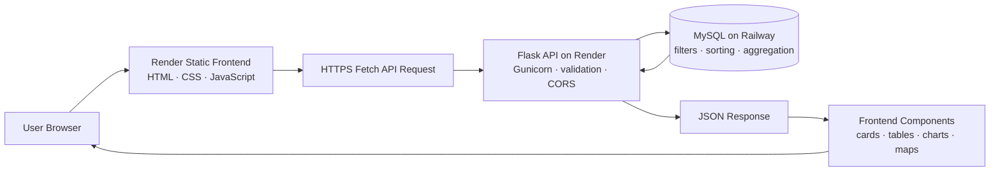

<p align="center">
  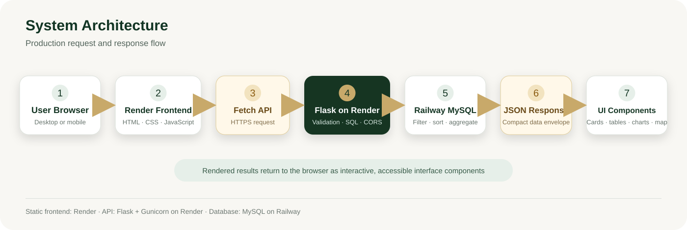
</p>

| Layer | Responsibility |
|---|---|
| Frontend | A Render Static Site serves the responsive multi-page interface, saved preferences, forms, tables, map markers, charts, and comparisons. |
| API layer | The browser sends cross-origin `fetch()` requests through the shared `loadApiData()` helper to the Render production API. |
| Backend | A Render Web Service runs Flask with Gunicorn. Flask validates parameters, builds parameterized SQL, formats JSON envelopes, and handles errors. |
| Database | Railway-hosted MySQL stores `tradgov_groups` and summary views and performs filtering, sorting, pagination, and aggregation. |
| Hosting | GitHub stores the source code. Render hosts both the static frontend and Flask API, while Railway hosts MySQL. Flask connects to Railway through environment variables. |

## How the Platform Works

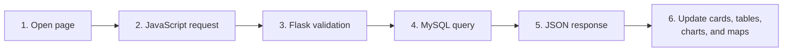

<p align="center">
  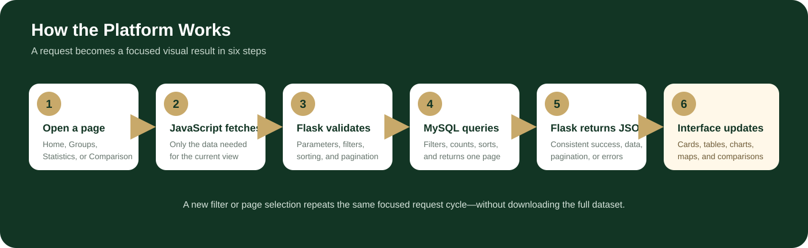
</p>

When a user changes a search term, filter, sort order, or page, the browser
repeats this focused request cycle. It does not download the entire dataset.

## Technology Stack

| Area | Technology | Use in this project |
|---|---|---|
| Structure | HTML5 | Six semantic application pages and native dialog/form elements |
| Styling | CSS3 | Responsive layouts, themes, RTL support, animations, map positioning |
| UI framework | Bootstrap 5 | Grid, forms, responsive utilities, and bundled JavaScript |
| Client logic | Vanilla JavaScript | API loading, normalization, filtering state, pagination, charts, preferences |
| Charts | Chart.js | Doughnut and bar charts with accessible canvas labels |
| Icons | Bootstrap Icons | Navigation, cards, controls, tables, and status indicators |
| Backend | Python and Flask | REST endpoints, validation, errors, and response formatting |
| CORS | Flask-CORS | Approved frontend origins for API requests |
| Database driver | `mysql-connector-python` | MySQL connection pool and dictionary cursors |
| Configuration | `python-dotenv` | Local environment-variable loading |
| Production server | Gunicorn 23 | Render production process |
| Database | MySQL | Group records, summary views, SQL filtering, sorting, and pagination |
| API hosting | Render | Public Flask API |
| Database hosting | Railway | Hosted MySQL database |
| Contact delivery | Resend | HTTPS email delivery without database storage |
| Source control | Git and GitHub | Repository and team collaboration |

## Dataset Overview

The deployed API reported the following values on **24 July 2026**:

| Metric | Confirmed value |
|---|---:|
| Traditional group records | 1,557 |
| Countries | 130 |
| Continents represented | 5 |
| Regions represented | 7 |
| Records with a traditional political institution (`any_tpi = 1`) | 1,351 |
| Formally acknowledged records | 744 |

These values come from the live [`/api/stats`](https://traditional-governance-data-analytics.onrender.com/api/stats)
endpoint and may change when the database is updated.

The active database table is `tradgov_groups`. Summary endpoints also read the
views `vw_country_summary`, `vw_continent_summary`, `vw_region_summary`, and
`vw_leadership_summary`.

## Data Fields

The table below documents fields that are confirmed in the API and frontend.
It does not assign academic meanings beyond those defined by the project UI.

| Category | API/database field | Frontend label or use |
|---|---|---|
| Record identity | `id` | Internal database identifier used by detail requests |
| Record identity | `groupid` | Source group identifier |
| Geography | `country` | Country |
| Geography | `continent` | Continent |
| Geography | `region` | Region |
| Group | `group_name` | Original/source group name |
| Group | `group_name_ar` | Optional manually reviewed Arabic name |
| Group | `groupsize` | Population/group size |
| Institution | `any_tpi` | Traditional political institution present |
| Leadership | `king` | King |
| Leadership | `chief` | Chief |
| Leadership | `headman` | Headman |
| Succession | `kinginher` | King selected through inheritance |
| Succession | `kingelect` | King selected through election |
| Succession | `kingapp` | King selected through appointment |
| Function | `func_land` | Land management |
| Function | `func_sec` | Security |
| Function | `kingheal` | Healing/healthcare value displayed as `Func_Heal` |
| Administration | `counceld` | Advisory or decision-making council |
| Administration | `assembly` | Public or community assembly |
| Recognition | `formackn` | Formal acknowledgement by the state |

The interface also contains a `Func_DR` display field for dispute resolution,
but the current live record structure does not provide a corresponding value.
The frontend therefore displays it as `Not Available`.

### Binary and missing values

Many institutional variables use:

- `1` → **Yes / Present**
- `0` → **No / Absent**
- `NULL` → **Not Available** or not applicable in the source record

The frontend preserves missingness rather than silently converting unknown
values to `No`.

## Main Application Pages

| Page | Purpose and interactions |
|---|---|
| [`index.html`](index.html) — Home | Hero introduction, live summary cards, tool navigation, latest records, and an SVG world map with live continent counts. Selecting a marker opens the Groups page with that continent filter. |
| [`groups.html`](groups.html) — Groups | Search, geographic and institutional filters, sortable table, server-side pagination, reset control, URL-synchronized state, and detailed group dialog. |
| [`statistics.html`](statistics.html) — Statistics | Live summary metrics and six Chart.js visualizations: leadership, functions, formal recognition, continent distribution, largest groups, and top ten countries. |
| [`comparison.html`](comparison.html) — Comparison | Loads lightweight group options, fetches two selected records by ID, supports swapping selections, and renders geography, leadership, functions, structure, and recognition side by side. |
| [`about.html`](about.html) — About | Explains project purpose, interface methodology, value handling, and supported data fields. |
| [`contact.html`](contact.html) — Contact | Validated project enquiry form that sends messages through the Flask email endpoint without storing them in the database. |

## Frontend Experience

The interface is organized around focused research tasks. Authentic screenshots
will be inserted only after verified captures exist; the paths below remain
plain text so GitHub never displays a broken or fabricated image.

| Experience | What it demonstrates | Planned screenshot |
|---|---|---|
| **Home Dashboard** | Live summary cards, latest groups, world distribution markers, and direct navigation to the main tools. | `assets/screenshots/home-dashboard.png` |
| **Groups Explorer** | Search, geographic and institutional filters, sorting, server-side pagination, URL state, and the full details dialog. | `assets/screenshots/groups-explorer.png` |
| **Statistics** | Leadership, functions, recognition, continent and country totals, largest groups, and top-country charts. | `assets/screenshots/statistics-dashboard.png` |
| **Comparison** | Two record selectors and a side-by-side view of geography, leadership, functions, administrative structure, and recognition. | `assets/screenshots/comparison-view.png` |
| **Arabic Interface** | Translated controls, RTL layout, Arabic-name fallback behavior, and a saved language preference. | `assets/screenshots/arabic-interface.png` |
| **Dark Mode** | Saved theme preference and consistent contrast across cards, forms, tables, comparison panels, and charts. | `assets/screenshots/dark-mode.png` |
| **Contact** | Validated submission to `POST /api/contact` with real success/error feedback and no database storage. | `assets/screenshots/contact-page.png` |

## Quick Start on Windows

Install [Git](https://git-scm.com/download/win) and
[Python 3.11 or 3.12](https://www.python.org/downloads/), then follow these six
steps. The SVG cards are **terminal command illustrations**; the code blocks
remain the authoritative, copyable commands.

### 1. Clone the project

```powershell
git clone https://github.com/mussabtaha/Traditional-Governance-Data-Analytics-and-Visualization-Platform.git
cd Traditional-Governance-Data-Analytics-and-Visualization-Platform
```

<p align="center">
  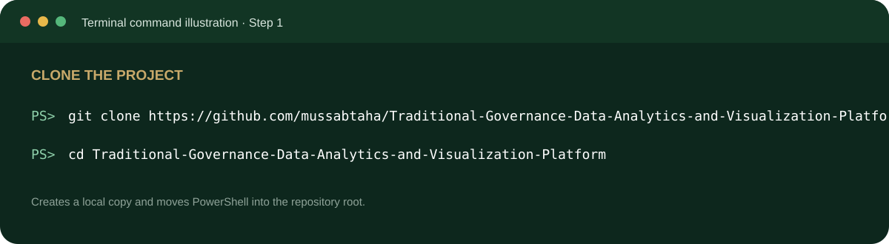
</p>

### 2. Create and activate the backend environment

```powershell
cd backend-flask
python -m venv .venv
.\.venv\Scripts\Activate.ps1
```

<p align="center">
  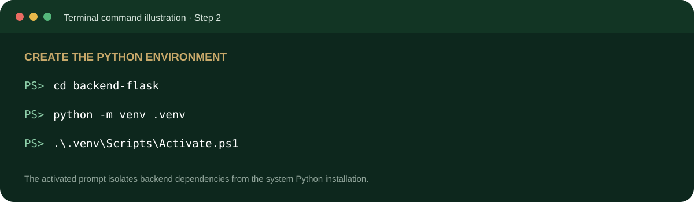
</p>

### 3. Install the backend requirements

```powershell
python -m pip install -r requirements.txt
```

<p align="center">
  
</p>

### 4. Create the local environment file

```powershell
Copy-Item .env.example .env
```

Add the Railway database values and the optional Resend contact-email values
described in [Detailed Windows Setup](#detailed-windows-setup). Never commit
`.env`.

<p align="center">
  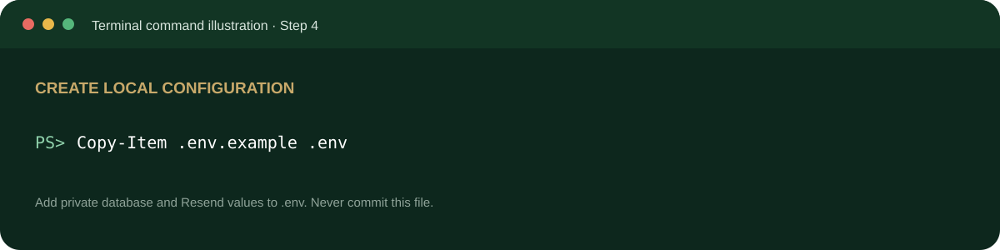
</p>

### 5. Run Flask in Terminal 1

```powershell
python app.py
```

Flask should be available at `http://127.0.0.1:3000`.

<p align="center">
  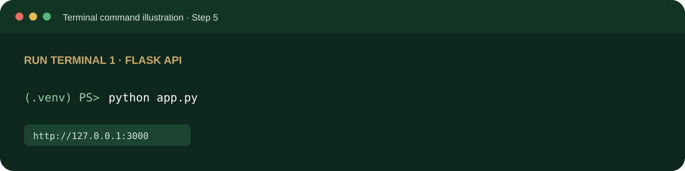
</p>

### 6. Run the frontend in Terminal 2

Open another PowerShell window at the repository root:

```powershell
python -m http.server 5500
```

Open `http://127.0.0.1:5500/index.html` and verify the local API at
`http://127.0.0.1:3000/api/stats`. Keep both terminals running.
The frontend uses the deployed API by default; apply the
[local backend override](#j-local-backend-override) when testing both local
services together.

<p align="center">
  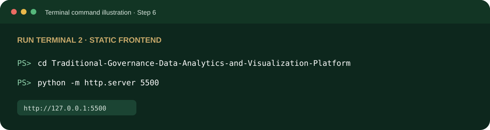
</p>

<p align="center">
  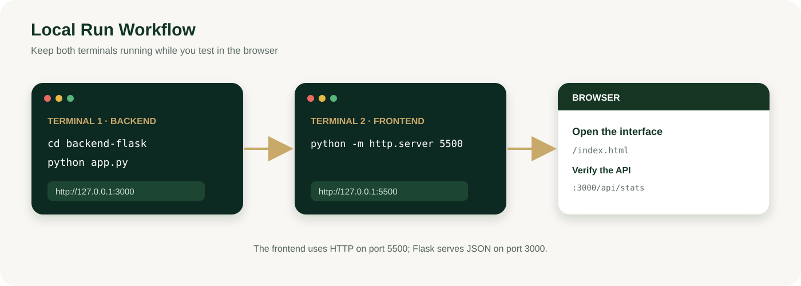
</p>

## API Documentation

**Base URL**

```text
https://traditional-governance-data-analytics.onrender.com/api
```

All successful endpoints use:

```json
{
  "success": true,
  "data": {}
}
```

Errors use a non-2xx HTTP status with:

```json
{
  "success": false,
  "message": "A user-readable error message."
}
```

### Endpoint reference

| Method | Path | Purpose | Parameters | Example |
|---|---|---|---|---|
| `GET` | `/api/health` | Check Flask and database availability | None | [`/api/health`](https://traditional-governance-data-analytics.onrender.com/api/health) |
| `GET` | `/api/stats` | Return overall counts, recognition, functions, and coverage totals | None | [`/api/stats`](https://traditional-governance-data-analytics.onrender.com/api/stats) |
| `GET` | `/api/countries` | Return country summary rows ordered by group total | None | [`/api/countries`](https://traditional-governance-data-analytics.onrender.com/api/countries) |
| `GET` | `/api/continents` | Return group totals by continent | None | [`/api/continents`](https://traditional-governance-data-analytics.onrender.com/api/continents) |
| `GET` | `/api/regions` | Return group totals by region | None | [`/api/regions`](https://traditional-governance-data-analytics.onrender.com/api/regions) |
| `GET` | `/api/leadership` | Return king, chief, and headman totals | None | [`/api/leadership`](https://traditional-governance-data-analytics.onrender.com/api/leadership) |
| `GET` | `/api/largest-groups` | Return the ten largest records with a population value | None | [`/api/largest-groups`](https://traditional-governance-data-analytics.onrender.com/api/largest-groups) |
| `GET` | `/api/top-countries` | Return the ten countries with the most group records | None | [`/api/top-countries`](https://traditional-governance-data-analytics.onrender.com/api/top-countries) |
| `GET` | `/api/group-options` | Return lightweight ID/name/country rows for comparison selectors | None | [`/api/group-options`](https://traditional-governance-data-analytics.onrender.com/api/group-options) |
| `GET` | `/api/groups` | Return one filtered, sorted, paginated group page | Query parameters below | [`/api/groups?page=1&limit=100`](https://traditional-governance-data-analytics.onrender.com/api/groups?page=1&limit=100) |
| `GET` | `/api/groups/<id>` | Return one complete group record | Positive integer path ID | [`/api/groups/1`](https://traditional-governance-data-analytics.onrender.com/api/groups/1) |
| `POST` | `/api/contact` | Validate and deliver a contact message by email | JSON: `name`, `email`, `subject`, `message` | No database write |

### Contact email delivery

Contact form messages are delivered through the Resend HTTPS Email API and are
**not stored in MySQL or any other database**. Configure `RESEND_API_KEY`,
`CONTACT_EMAIL`, and `FROM_EMAIL` in the local backend `.env` file and as
secret environment variables in the Render backend service. `FROM_EMAIL` must
use a sender address on a domain verified in Resend.

Render Free blocks direct outbound SMTP ports, so the project uses Resend over
HTTPS instead of SMTP. The browser never receives or stores the Resend API key.

`RESEND_API_KEY` is a secret: never place a real API key in source code, README
examples, screenshots, commits, or frontend JavaScript.

For deployment, verify a sender domain in the
[Resend Domains dashboard](https://resend.com/docs/dashboard/domains/introduction),
create a sending-access key in the
[Resend API Keys dashboard](https://resend.com/docs/dashboard/api-keys/introduction),
and add the following environment variables to the Render backend service:

```dotenv
RESEND_API_KEY=your_resend_api_key
CONTACT_EMAIL=destination@example.com
FROM_EMAIL=Traditional Governance <contact@your-verified-domain.example>
```

### `/api/groups` query parameters

| Parameter | Accepted values | Behavior |
|---|---|---|
| `page` | Positive integer; default `1` | Requested result page |
| `limit` | `1`–`100`; default `20` | Records returned per page |
| `search` | Text | Searches `group_name`, `group_name_ar`, and `country` |
| `country` | Exact country value | SQL country filter |
| `continent` | Exact continent value | SQL continent filter |
| `region` | Exact region value | SQL region filter |
| `leadership` | `King`, `Chief`, `Headman` | Requires the selected leadership column to equal `1` |
| `recognition` | `1`, `0`, `missing` | Filters `formackn` |
| `any_tpi` | `1`, `0`, `missing` | Filters traditional institution availability |
| `sort` | `id`, `GroupName`, `country`, `continent`, `region`, `population`, `FormAckn` and supported aliases | Whitelisted SQL sort field |
| `direction` | `asc`, `desc` | Sort direction |

Example request:

```http
GET /api/groups?page=1&limit=100&continent=Africa&leadership=Chief&recognition=1&sort=Population&direction=desc
```

Paginated response shape:

```json
{
  "success": true,
  "data": {
    "groups": [
      {
        "id": 1,
        "country": "Example country",
        "continent": "Africa",
        "region": "Example region",
        "group_name": "Example group",
        "group_name_ar": null,
        "any_tpi": 1
      }
    ],
    "pagination": {
      "page": 1,
      "limit": 100,
      "total_items": 726,
      "total_pages": 8
    }
  }
}
```

<details>
<summary><strong>Additional short response examples</strong></summary>

Health:

```json
{
  "success": true,
  "data": {
    "backend": "connected",
    "database": "connected"
  }
}
```

Continent summaries:

```json
{
  "success": true,
  "data": [
    {
      "continent": "Africa",
      "total_groups": 726
    }
  ]
}
```

Comparison options:

```json
{
  "success": true,
  "data": [
    {
      "id": 1,
      "group_name": "Example group",
      "group_name_ar": null,
      "country": "Example country"
    }
  ]
}
```

Single group:

```json
{
  "success": true,
  "data": {
    "id": 1,
    "groupid": 2001012,
    "group_name": "Example group",
    "group_name_ar": null,
    "country": "Example country",
    "any_tpi": 1,
    "formackn": 1
  }
}
```

</details>

## Server-Side Pagination and Filtering

The first frontend implementation downloaded every Groups API page and combined
all records in JavaScript. As the database and network distance increased, that
approach produced unnecessary requests, longer waits, and excessive browser
memory use.

The current implementation uses proper server-side pagination:

- the first Groups-page data request is `/groups?page=1&limit=100`;
- pages 2–16 are not requested during initial loading;
- selecting another page requests only that page;
- search, country, continent, region, leadership, recognition, TPI, sort, and
  direction values are sent as query parameters;
- Flask validates the parameters and uses whitelisted field mappings;
- MySQL executes filtering, sorting, total counting, `LIMIT`, and `OFFSET`;
- the response provides `page`, `limit`, `total_items`, and `total_pages`;
- the browser stores only the current page of full group records;
- comparison selectors use lightweight option rows, while full records are
  requested by ID only when selected;
- `AbortController` cancels superseded explorer requests, and a controller
  identity check prevents stale responses from replacing newer results.

This design reduces network traffic, improves Railway/Render performance, keeps
the interface responsive, and scales more effectively than downloading the
entire dataset on every visit.

## Project Structure

```text
Traditional-Governance-Data-Analytics-and-Visualization-Platform/
├── index.html                       # Home dashboard and interactive map
├── groups.html                      # Search, filters, table, details, pagination
├── statistics.html                  # Summary cards and Chart.js visualizations
├── comparison.html                  # Side-by-side group comparison
├── about.html                       # Project purpose and field information
├── contact.html                     # Email-backed project enquiry form
├── css/
│   ├── home.css                     # Homepage-specific layout and map styling
│   └── style.css                    # Shared components, themes, RTL, responsiveness
├── js/
│   ├── preferences.js               # Early global language/theme persistence
│   ├── i18n.js                      # English/Arabic translation behavior
│   └── script.js                    # API, rendering, charts, filters, comparison
├── assets/
│   ├── images/
│   │   ├── hero-village.png
│   │   └── world-map.svg
│   ├── icons/
│   ├── readme/
│   │   ├── header.svg
│   │   ├── system-architecture.svg
│   │   ├── platform-workflow.svg
│   │   ├── local-run-workflow.svg
│   │   ├── deployment-flow.svg
│   │   └── step-*.svg                  # Six terminal command illustrations
│   ├── screenshots/
│   │   └── README.md                # Authentic screenshot capture guide
│   ├── vendor/                      # Local Bootstrap, icons, fonts, and Chart.js
│   └── world-countries.geojson
├── data/
│   └── groups.json                  # Legacy/sample frontend data; active UI uses API
├── backend-flask/
│   ├── app.py                       # Flask factory, CORS, errors, application entry
│   ├── config.py                    # Environment-backed settings
│   ├── requirements.txt             # Python dependencies
│   ├── .env.example                 # Safe local configuration template
│   ├── database/
│   │   └── db.py                    # Lazy MySQL pool and query helpers
│   ├── routes/
│   │   └── api.py                   # REST endpoints and SQL filters
│   ├── migrations/
│   │   ├── 001_add_group_name_ar.sql
│   │   ├── 002_fix_confirmed_group_name_encoding.sql
│   │   ├── encoding_diagnosis_report.md
│   │   └── reviewed_arabic_group_names.sql
│   ├── scripts/
│   │   ├── encoding_diagnosis.py
│   │   └── apply_encoding_repairs.py
│   └── tests/
│       ├── test_server_pagination.py
│       └── test_contact.py
└── .gitignore
```

Generated folders, credentials, virtual environments, Git internals, and
temporary files are intentionally omitted.

## Detailed Windows Setup

This guide starts from a clean Windows computer. It runs the Flask backend and
static frontend locally while using valid credentials for the existing Railway
database.

<details>
<summary><strong>Open the complete Windows setup, local override, and troubleshooting guide</strong></summary>

### A. Required software

Install:

- [Git for Windows](https://git-scm.com/download/win)
- [Python](https://www.python.org/downloads/) — Python 3.11 or 3.12 is recommended
- [Visual Studio Code](https://code.visualstudio.com/)
- the VS Code **Live Server** extension, or Python's built-in HTTP server
- a modern browser such as Chrome, Edge, or Firefox

The following applications are **not required** to run the project:

- Node.js;
- HeidiSQL;
- a local MySQL server, when valid Railway credentials are available.

### B. Clone the repository

Open PowerShell:

```powershell
git clone https://github.com/mussabtaha/Traditional-Governance-Data-Analytics-and-Visualization-Platform.git
cd Traditional-Governance-Data-Analytics-and-Visualization-Platform
```

### C. Enter the Flask backend

```powershell
cd backend-flask
```

### D. Create a new virtual environment

```powershell
python -m venv .venv
```

Create a new `.venv` on each computer. Do not copy or reuse a virtual
environment created on another computer because its paths and installed
binaries are machine-specific.

### E. Activate the environment

PowerShell:

```powershell
.\.venv\Scripts\Activate.ps1
```

If PowerShell blocks the activation script:

```powershell
Set-ExecutionPolicy -Scope Process -ExecutionPolicy Bypass
.\.venv\Scripts\Activate.ps1
```

The policy change above affects only the current PowerShell process.

Command Prompt alternative:

```bat
.venv\Scripts\activate.bat
```

### F. Install dependencies

```powershell
python -m pip install --upgrade pip
python -m pip install -r requirements.txt
```

### G. Create the `.env` file

PowerShell:

```powershell
Copy-Item .env.example .env
```

Command Prompt alternative:

```bat
copy .env.example .env
```

Open `.env` and enter credentials supplied securely by the project owner:

```dotenv
DB_HOST=
DB_PORT=
DB_USER=
DB_PASSWORD=
DB_NAME=tradgov_db
PORT=3000
RESEND_API_KEY=your_resend_api_key
CONTACT_EMAIL=destination_email_address
FROM_EMAIL=verified_sender_email_address
```

| Variable | Purpose |
|---|---|
| `DB_HOST` | Railway MySQL host |
| `DB_PORT` | Railway MySQL port |
| `DB_USER` | MySQL user |
| `DB_PASSWORD` | MySQL password |
| `DB_NAME` | Database name, normally `tradgov_db` |
| `PORT` | Local Flask port |
| `RESEND_API_KEY` | Secret API key used only by Flask to call Resend over HTTPS |
| `CONTACT_EMAIL` | Destination address that receives contact messages |
| `FROM_EMAIL` | Sender address on a domain verified in Resend |

> **Never commit `.env` to GitHub.** The project owner must share valid
> database credentials securely and separately, never in Git, email screenshots,
> public chat, or README examples.

### H. Run the backend

From `backend-flask`, with `.venv` active:

```powershell
python app.py
```

Expected local backend:

```text
http://127.0.0.1:3000
```

Verify the API in a browser:

```text
http://127.0.0.1:3000/api/stats
```

Or verify it in PowerShell:

```powershell
Invoke-WebRequest -UseBasicParsing http://127.0.0.1:3000/api/stats
```

### I. Run the frontend

Keep Flask running and open a second terminal or VS Code window at the
repository root.

#### Method 1 — VS Code Live Server

1. Open the repository root in VS Code.
2. Open `index.html`.
3. Click **Go Live**.
4. Confirm that the browser opens:

```text
http://127.0.0.1:5500/index.html
```

#### Method 2 — Python static server

From the repository root:

```powershell
python -m http.server 5500
```

Then open:

```text
http://127.0.0.1:5500/index.html
```

Do not open pages directly with a `file:///` URL. An HTTP server gives the
frontend a valid origin for API and CORS behavior.

### J. Local backend override

The frontend uses the deployed Render API by default:

```text
https://traditional-governance-data-analytics.onrender.com/api
```

For local full-stack testing, place this configuration before the shared
`js/script.js` element in the HTML page being tested:

```html
<script>
  window.TRADGOV_CONFIG = {
    apiBaseUrl: "http://localhost:3000/api"
  };
</script>
```

- **Production mode:** uses the Render API.
- **Local mode:** can override the base URL with `window.TRADGOV_CONFIG`.
- Remove or disable the local override before production deployment.

### K. Complete run order

1. Install Python and Git.
2. Clone the repository.
3. Create a new `.venv`.
4. Activate `.venv`.
5. Install `requirements.txt`.
6. Create `.env` and enter securely supplied credentials.
7. Run Flask with `python app.py`.
8. Run Live Server or `python -m http.server 5500`.
9. Open the frontend in a browser.
10. Verify `/api/stats` and confirm that the UI displays live records.

### L. Common problems and fixes

<details>
<summary><strong>Open the Windows troubleshooting table</strong></summary>

| Problem | Direct solution |
|---|---|
| `python` is not recognized | Install Python from python.org, enable **Add Python to PATH**, reopen the terminal, or try `py` instead of `python`. |
| `git` is not recognized | Install Git for Windows and reopen PowerShell or VS Code. |
| `Activate.ps1` is not recognized | Confirm that the terminal is inside `backend-flask` and that `.venv` was created successfully. |
| PowerShell execution-policy error | Run `Set-ExecutionPolicy -Scope Process -ExecutionPolicy Bypass`, then activate again. |
| `.venv` is missing | Run `python -m venv .venv` inside `backend-flask`; do not copy another person's environment. |
| `.env` is missing | Run `Copy-Item .env.example .env`, then add valid credentials. |
| Database connection error | Check `DB_HOST`, `DB_PORT`, `DB_USER`, `DB_PASSWORD`, Railway availability, and whether the credentials are still valid. This is different from a route 404. |
| CORS error | Confirm that the frontend origin exactly matches an origin in Flask's `ALLOWED_ORIGINS`. Include scheme, host, and port. |
| `gunicorn: command not found` | Activate `.venv` and reinstall `requirements.txt`. On Windows, use `python app.py`; Gunicorn is the Render/Linux production server. |
| `Endpoint not found` | The backend root `/` has no route, so its 404 is normal. Test `/api/stats` or `/api/health`. |
| Render service is slow initially | A sleeping free service may take a short time to wake. Wait and retry the API endpoint. |
| Frontend loads but data is missing | Test the configured API `/api/stats`, inspect the browser console/network panel, confirm the API base URL, and distinguish API/CORS errors from database failures. |

</details>

</details>

## Deployment Architecture

<p align="center">
  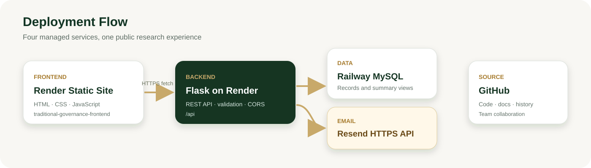
</p>

| Platform | Responsibility |
|---|---|
| GitHub | Source control for the frontend, Flask backend, migrations, tests, and documentation |
| Render Static Site | Hosts the public frontend at [traditional-governance-frontend.onrender.com](https://traditional-governance-frontend.onrender.com) |
| Render Web Service | Hosts the Flask API at [traditional-governance-data-analytics.onrender.com](https://traditional-governance-data-analytics.onrender.com/api/health) |
| Railway | Hosts the MySQL database |
| Resend | Delivers Contact-page messages through an HTTPS email API without storing them in MySQL |

Render should run from the `backend-flask` working directory with:

```text
gunicorn app:app
```

The browser loads the static frontend from Render and sends `fetch()` requests
to the Render Flask service. Flask connects securely to Railway using
environment variables stored in the hosting environment.

The current Flask-CORS configuration explicitly permits:

```text
http://localhost:5500
http://127.0.0.1:5500
https://traditional-governance-frontend.onrender.com
```

The production frontend origin must remain in Flask's allowed-origin list.
Changing the frontend domain or adding a custom domain requires adding that
exact new origin and redeploying the backend.

## Testing and Verification

The repository contains ten Flask contract tests covering:

- combined SQL filtering, sorting, and pagination;
- missing recognition values;
- out-of-range page totals;
- invalid leadership rejection;
- invalid sort-direction rejection;
- the lightweight comparison-options endpoint;
- valid contact email construction and one mocked Resend HTTPS request;
- contact input validation and maximum lengths;
- missing Resend configuration and safe provider failure responses;
- confirmation that contact delivery performs no database operation.

Run them from `backend-flask` after configuring the environment:

```powershell
python -m unittest discover -s tests -t .
```

Useful verification commands:

```powershell
# Python syntax
python -m compileall app.py config.py database routes tests

# Shared frontend JavaScript syntax
node --check ..\js\script.js

# Local API health
Invoke-WebRequest -UseBasicParsing http://localhost:3000/api/health

# Production statistics response
Invoke-WebRequest -UseBasicParsing `
  https://traditional-governance-data-analytics.onrender.com/api/stats
```

Checks performed during the documented refactor included HTTP 200 verification,
database row-count verification, pagination metadata checks, SQL-filter tests,
page-change tests, filter-reset tests, CORS response checks, and browser-console
inspection.

No GitHub Actions or other automated CI/CD workflow is currently present, so
this README does not claim continuous integration.

## Security Notes

- Store database credentials only in environment variables.
- Keep `.env` in `.gitignore`; never commit it.
- Do not commit `.venv`, `__pycache__`, local logs, or credential exports.
- Keep user-supplied values in parameterized SQL queries.
- Keep sort and leadership fields restricted to server-side allowlists.
- Store production secrets in Render and Railway environment settings.
- Keep `RESEND_API_KEY` only in backend environment variables; never commit it
  or expose it to frontend code.
- Rotate database credentials immediately if they are exposed.
- Never place real credentials, private hosts, or secret URLs in README examples.
- Keep local and production CORS origins explicit; add new domains only after review.
- The dataset API remains read-only. The only `POST` route is `/api/contact`,
  which sends an email and does not write to the database.

## Team Collaboration on GitHub

The repository owner can invite team members from the repository's
**Settings → Collaborators** page. Each invitation must be accepted before that
person receives collaborator access. A pending invitation is not an active
collaborator.

Collaborator access and the GitHub **Contributors** list are different:

- accepting an invitation grants repository access;
- a collaborator does not automatically appear under Contributors;
- a person normally appears after commits authored by their Git identity are
  pushed to the repository or merged through a pull request;
- the repository can remain under the owner's username even when several
  collaborators work on it;
- a GitHub Organization is optional if the team wants the repository owner name
  to represent the group rather than one person.

Each member should use their own GitHub account and configure their own identity:

```powershell
git config --global user.name "Full Name"
git config --global user.email "email@example.com"
```

Pull the latest shared work before editing or pushing:

```powershell
git pull
```

Standard collaboration workflow:

```powershell
git add .
git commit -m "Describe the change"
git pull
git push
```

Resolve any pull conflicts carefully before pushing. Never share one GitHub
account among all team members.

## Team Members

<!--
Replace the placeholder rows below with the verified team details.
Do not add names, student IDs, or GitHub profiles without each member's approval.
-->

GitHub collaborator access does not update this table automatically. The team
must manually add each verified member's name, student ID, role, and GitHub
profile.

| Name | Student ID | Role | GitHub |
|---|---|---|---|
| _Team member 1_ | _Student ID_ | _Role_ | _GitHub profile_ |
| _Team member 2_ | _Student ID_ | _Role_ | _GitHub profile_ |
| _Team member 3_ | _Student ID_ | _Role_ | _GitHub profile_ |
| _Team member 4_ | _Student ID_ | _Role_ | _GitHub profile_ |

## Academic Information

| Item | Details |
|---|---|
| University | _Add university name_ |
| Faculty | _Add faculty name_ |
| Department | _Add department name_ |
| Supervisor | _Add supervisor name and title_ |
| Academic year | _20XX / 20XX_ |
| Course / project title | _Add the official graduation-project course title_ |

## Future Improvements

- Add a custom domain for the deployed frontend.
- Add uptime monitoring for the Render frontend and API.
- Add automated deployment and post-deployment health checks.
- Add more reviewed screenshots and a short demonstration video.
- Expand manually reviewed Arabic group names without changing source names.
- Add export and citation features for research workflows.
- Add automated accessibility and cross-browser regression testing.
- Add CI/CD validation for Python, JavaScript, API contracts, and documentation links.
- Add a controlled data-administration workflow if future project scope permits it.
- Document the dataset's approved academic citation and codebook provenance.

These are proposed extensions, not features claimed by the current system.

## Acknowledgements

This project uses open-source technologies including Python, Flask, MySQL
Connector/Python, Flask-CORS, Bootstrap, Bootstrap Icons, and Chart.js.

The project team should add the verified dataset citation, university,
supervisor, academic reviewers, and any research collaborators before final
submission.

## License and Academic Usage Notice

This repository does not currently include an open-source `LICENSE` file.
Unless the project owners add one, the source and documentation should be
treated as an academic graduation-project submission. Reuse, redistribution,
or publication should be approved by the project team and the relevant
university.

Dataset rights and citation requirements remain subject to the original data
source and institutional guidance.

---

<p align="center">
  <strong>Traditional Governance Data Analytics and Visualization Platform</strong><br>
  Built for transparent exploration, responsible interpretation, and academic analysis.
</p>
