<p align="center">
  
</p>

<h1 align="center">Traditional Governance Data Analytics and Visualization Platform</h1>

<p align="center">
  A production-deployed research and analytics platform for exploring, comparing, and visualizing traditional governance groups worldwide.
</p>

<p align="center">
  <a href="https://traditional-governance-frontend.onrender.com">
    
  </a>
  <a href="https://traditional-governance-data-analytics.onrender.com/api/stats">
    
  </a>
  <a href="https://github.com/mussabtaha/Traditional-Governance-Data-Analytics-and-Visualization-Platform">
    
  </a>
</p>

<p align="center">
  <a href="https://traditional-governance-frontend.onrender.com">Frontend</a>
  &nbsp;·&nbsp;
  <a href="https://traditional-governance-data-analytics.onrender.com/api/health">Backend API health</a>
  &nbsp;·&nbsp;
  <a href="https://traditional-governance-data-analytics.onrender.com/api/stats">API test endpoint</a>
</p>

<p align="center">
  <a href="https://developer.mozilla.org/en-US/docs/Web/HTML"></a>
  <a href="https://developer.mozilla.org/en-US/docs/Web/CSS"></a>
  <a href="https://developer.mozilla.org/en-US/docs/Web/JavaScript"></a>
  <a href="https://getbootstrap.com/"></a>
  <a href="https://www.python.org/"></a>
  <a href="https://flask.palletsprojects.com/"></a>
  <a href="https://github.com/mysql/mysql-server"></a>
  <a href="https://render.com/"></a>
  <a href="https://railway.com/"></a>
  <a href="https://github.com/mussabtaha/Traditional-Governance-Data-Analytics-and-Visualization-Platform"></a>
</p>

<p align="center">
  <a href="#live-demo">Live Demo</a> ·
  <a href="#screenshots">Screenshots</a> ·
  <a href="#project-overview">Overview</a> ·
  <a href="#system-architecture">Architecture</a> ·
  <a href="#interactive-geographic-statistics">Statistics</a> ·
  <a href="#how-to-run-locally">Quick Start</a> ·
  <a href="#dataset-overview">Dataset</a> ·
  <a href="#api-documentation">API</a> ·
  <a href="#detailed-windows-setup">Detailed Setup</a> ·
  <a href="#contributing">Contributing</a> ·
  <a href="#testing-and-verification">Testing</a>
</p>

---

## Live Demo

| Service | Link | Status |
|---|---|---|
| Frontend application | [traditional-governance-frontend.onrender.com](https://traditional-governance-frontend.onrender.com) | Live Render Static Site |
| Flask API health | [`GET /api/health`](https://traditional-governance-data-analytics.onrender.com/api/health) | Live Render Web Service |
| API example | [`GET /api/stats`](https://traditional-governance-data-analytics.onrender.com/api/stats) | Live JSON response |

> Render may need a short warm-up period before the first response when the
> service has been inactive. The backend root URL has no `/` route and normally
> returns `Endpoint not found`; use `/api/health` or `/api/stats` to test it.

## Screenshots

The screenshots below were captured at `1440 × 900` from the running frontend
after the API and real MySQL-backed dataset finished loading. They show the
actual application—no generated mockups, substituted data, or browser-error
pages are used.

<p align="center">
  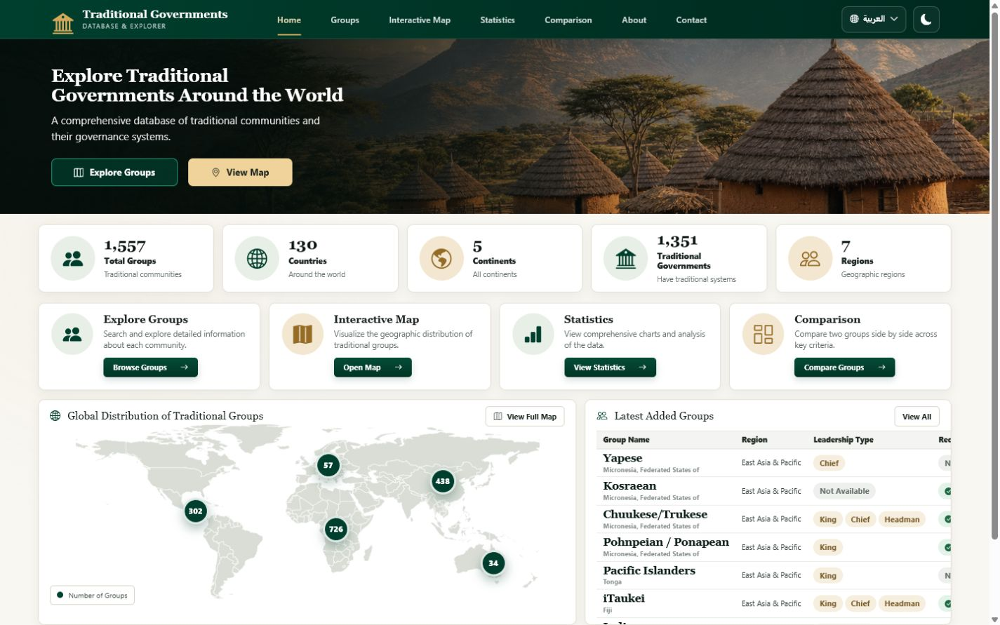
</p>

<p align="center">
  <strong>Home Dashboard</strong><br>
  <sub>Live project metrics, research tools, geographic distribution, and recently added records.</sub>
</p>

The [screenshot capture guide](assets/screenshots/README.md) records the
viewport, loading checks, privacy checks, and language/theme states used for
these authentic captures.

## Project Overview

The Traditional Governance Data Analytics and Visualization Platform is a
full-stack university graduation project and interactive research system for
exploring traditional governance groups around the world. Users can browse and
search group records, combine server-side geographic and institutional filters,
move through paginated results, inspect full group details, compare two groups,
explore a geographic map, and study descriptive or geographically filtered
statistics.

The active frontend is built with standard web technologies and communicates
with a Flask REST API. The API uses parameterized SQL queries and a MySQL
connection pool. MySQL performs pagination, filtering, sorting, and aggregation
before returning compact JSON responses to the browser. The interface is fully
responsive, supports Arabic and English with correct RTL/LTR behavior, and
persists the user's dark or light theme across pages.

### ملخص المشروع بالعربية

منصة أكاديمية تفاعلية لاستكشاف بيانات الحوكمة التقليدية وتحليلها وعرضها
بصرياً. تتيح المنصة البحث في سجلات المجموعات، وتطبيق المرشحات الجغرافية
والمؤسسية، ومقارنة مجموعتين، واستعراض الإحصاءات والرسوم البيانية وخريطة
التوزيع العالمي. تتصل الواجهة الأمامية بواجهة برمجية مبنية باستخدام Flask،
بينما تُنفَّذ عمليات التصفية والترتيب وترقيم الصفحات داخل قاعدة بيانات MySQL.

## Problem Statement

Traditional governance datasets contain many geographic, institutional, and
binary variables. Reading these records directly from spreadsheets or database
tables makes it difficult to:

- locate a specific group quickly;
- combine geographic and governance criteria;
- interpret `1`, `0`, and missing values consistently;
- compare institutional characteristics across groups;
- understand continent, country, leadership, function, and recognition trends;
- present the dataset clearly to non-technical users.

This project addresses that problem with a responsive interface and a
server-backed data layer that converts raw records into searchable tables,
human-readable details, comparisons, maps, and statistical summaries.

## Project Objectives

1. Provide a clear, responsive interface for exploring traditional governance data.
2. Support bilingual English and Arabic presentation with correct LTR and RTL behavior.
3. Convert binary and missing values into understandable interface labels.
4. Enable SQL-backed search, filtering, sorting, and pagination.
5. Present aggregate patterns through summary cards, charts, and a world map.
6. Allow side-by-side comparison of two group records.
7. Keep the frontend modular and the API contract suitable for future development.
8. Protect database credentials and use parameterized SQL with pooled connections.

## Features

- ✔ **Interactive Dashboard** — live metrics, recent records, research tools,
  and continent totals.
- ✔ **Groups Explorer** — searchable records, advanced filters, sortable
  columns, detailed views, and shareable URL state.
- ✔ **Interactive Map** — responsive world map with live continent markers
  that open matching Groups results.
- ✔ **Statistics Dashboard** — descriptive metrics and six Chart.js
  visualizations.
- ✔ **Interactive Geographic Statistics Filtering** — analyze all data or one
  country, continent, or region without reloading the page.
- ✔ **Group Comparison** — lightweight selector data and on-demand
  side-by-side record details.
- ✔ **Search** — English names, optional Arabic names, and countries.
- ✔ **Pagination** — one SQL-backed result page at a time.
- ✔ **Server-Side Filtering** — country, continent, region, leadership,
  recognition, and TPI filters execute in MySQL.
- ✔ **REST API** — structured success/error envelopes, validation, CORS, and
  parameterized SQL.
- ✔ **Responsive Design** — desktop, tablet, and mobile layouts.
- ✔ **Dark / Light Theme** — persisted globally through `localStorage`.
- ✔ **Arabic / English** — translated interface, RTL/LTR layout, and safe
  bidirectional group-name rendering.
- ✔ **MySQL Optimized Indexes** — geographic and institutional filter paths
  are indexed for efficient production queries.
- ✔ **Accessible Data Presentation** — semantic controls, keyboard operation,
  and explicit `Yes`, `No`, and `Not Available` values.

## System Architecture

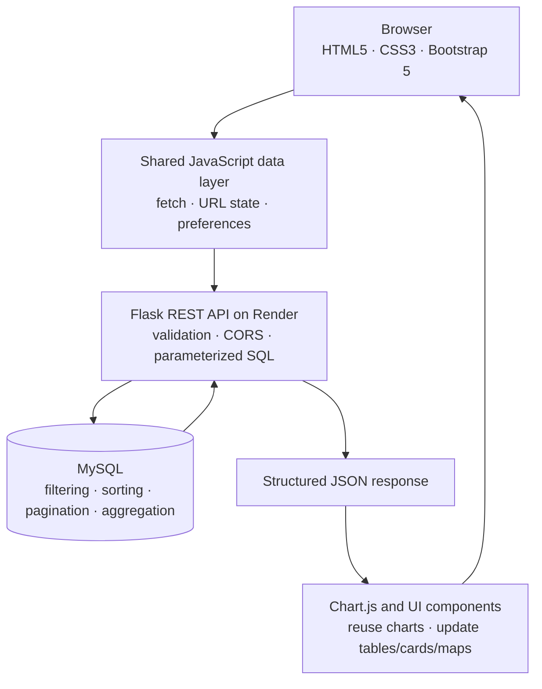

<p align="center">
  
</p>

| Layer | Responsibility |
|---|---|
| Frontend | A Render Static Site serves the responsive multi-page interface, saved preferences, forms, tables, map markers, charts, and comparisons. |
| API layer | The browser sends cross-origin `fetch()` requests through the shared `loadApiData()` helper to the Render production API. |
| Backend | A Render Web Service runs Flask with Gunicorn. Flask validates parameters, builds parameterized SQL, formats JSON envelopes, and handles errors. |
| Database | Railway-hosted MySQL stores `tradgov_groups` and summary views, uses optimized indexes, and performs filtering, sorting, pagination, and aggregation. |
| Hosting | GitHub stores the source code. Render hosts both the static frontend and Flask API, while Railway hosts MySQL. Flask connects to Railway through environment variables. |

The frontend does not calculate dataset statistics from downloaded records.
Flask asks MySQL to perform every count, grouping, ranking, and geographic
aggregation. JavaScript receives the resulting JSON and is responsible only
for formatting values, maintaining interface state, and updating the existing
Chart.js or DOM components.

## How the Platform Works

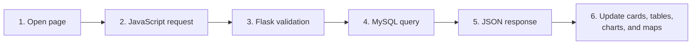

<p align="center">
  
</p>

When a user changes a search term, filter, sort order, or page, the browser
repeats this focused request cycle. It does not download the entire dataset.

## Technologies

| Area | Technology | Use in this project |
|---|---|---|
| Structure | HTML5 | Six semantic application pages and native dialog/form elements |
| Styling | CSS3 | Responsive layouts, themes, RTL support, animations, map positioning |
| UI framework | Bootstrap 5.3.3 | Grid, forms, responsive utilities, and bundled JavaScript |
| Client logic | Vanilla JavaScript | API loading, normalization, filtering state, pagination, charts, preferences |
| Charts | Chart.js 4.4.4 | Reusable doughnut and bar charts with accessible canvas labels |
| Icons | Bootstrap Icons | Navigation, cards, controls, tables, and status indicators |
| Backend | Python 3.11+ and Flask | REST endpoints, validation, errors, and response formatting |
| CORS | Flask-CORS | Approved local and deployed frontend origins for API requests |
| Database driver | `mysql-connector-python` | MySQL connection pool and dictionary cursors |
| Configuration | `python-dotenv` | Local environment-variable loading |
| Production server | Gunicorn 23 | Render production process |
| Database | MySQL | Group records, summary views, SQL filtering, sorting, and pagination |
| Database hosting | Railway | Hosted MySQL database |
| Contact delivery | Resend | HTTPS email delivery without database storage |
| Deployment | Render Web Service and Render Static Site | Flask API and production frontend hosting |
| Source control | Git and GitHub | Repository, review workflow, and team collaboration |

## Dataset Overview

The deployed API reported the following values on **24 July 2026**:

| Metric | Confirmed value |
|---|---:|
| Traditional group records | 1,557 |
| Countries | 130 |
| Continents represented | 5 |
| Regions represented | 7 |
| Records with a traditional political institution (`any_tpi = 1`) | 1,351 |
| Formally acknowledged records | 744 |

These values come from the live [`/api/stats`](https://traditional-governance-data-analytics.onrender.com/api/stats)
endpoint and may change when the database is updated.

The active database table is `tradgov_groups`. Summary endpoints also read the
views `vw_country_summary`, `vw_continent_summary`, `vw_region_summary`, and
`vw_leadership_summary`.

## Database and Query Optimization

MySQL is the authoritative data and analytics layer. The Flask API does not
load the full table to calculate results in Python; it sends focused SQL
queries for filtering, pagination, totals, grouped distributions, and ranked
lists.

The production schema includes indexes for the fields most frequently used by
the Groups Explorer and Statistics page:

| Index coverage | Supports |
|---|---|
| `country` | Country filtering and validation |
| `continent` | Continent filtering, map totals, and continent statistics |
| `region` | Region filtering and region statistics |
| Geographic scope + `formackn` | Composite recognition-filter queries |
| Geographic scope + `any_tpi` | Composite traditional-institution-filter queries |

These indexes complement server-side `LIMIT`/`OFFSET`, window counts,
whitelisted sorting, and grouped aggregate queries. Index names and column
order remain database-administration details; application code depends on the
query contract rather than a particular index name.

## Data Fields

The table below documents fields that are confirmed in the API and frontend.
It does not assign academic meanings beyond those defined by the project UI.

| Category | API/database field | Frontend label or use |
|---|---|---|
| Record identity | `id` | Internal database identifier used by detail requests |
| Record identity | `groupid` | Source group identifier |
| Geography | `country` | Country |
| Geography | `continent` | Continent |
| Geography | `region` | Region |
| Group | `group_name` | Original/source group name |
| Group | `group_name_ar` | Optional manually reviewed Arabic name |
| Group | `groupsize` | Population/group size |
| Institution | `any_tpi` | Traditional political institution present |
| Leadership | `king` | King |
| Leadership | `chief` | Chief |
| Leadership | `headman` | Headman |
| Succession | `kinginher` | King selected through inheritance |
| Succession | `kingelect` | King selected through election |
| Succession | `kingapp` | King selected through appointment |
| Function | `func_land` | Land management |
| Function | `func_sec` | Security |
| Function | `kingheal` | Healing/healthcare value displayed as `Func_Heal` |
| Administration | `counceld` | Advisory or decision-making council |
| Administration | `assembly` | Public or community assembly |
| Recognition | `formackn` | Formal acknowledgement by the state |

The interface also contains a `Func_DR` display field for dispute resolution,
but the current live record structure does not provide a corresponding value.
The frontend therefore displays it as `Not Available`.

### Binary and missing values

Many institutional variables use:

- `1` → **Yes / Present**
- `0` → **No / Absent**
- `NULL` → **Not Available** or not applicable in the source record

The frontend preserves missingness rather than silently converting unknown
values to `No`.

## Main Application Pages

| Page | Purpose and interactions |
|---|---|
| [`index.html`](index.html) — Home | Hero introduction, live summary cards, tool navigation, latest records, and an SVG world map with live continent counts. Selecting a marker opens the Groups page with that continent filter. |
| [`groups.html`](groups.html) — Groups | Search, geographic and institutional filters, sortable table, server-side pagination, reset control, URL-synchronized state, and detailed group dialog. |
| [`statistics.html`](statistics.html) — Statistics | Interactive country, continent, and region analysis with live summary metrics and six Chart.js visualizations that update in place. |
| [`comparison.html`](comparison.html) — Comparison | Loads lightweight group options, fetches two selected records by ID, supports swapping selections, and renders geography, leadership, functions, structure, and recognition side by side. |
| [`about.html`](about.html) — About | Explains project purpose, interface methodology, value handling, and supported data fields. |
| [`contact.html`](contact.html) — Contact | Validated project enquiry form that sends messages through the Flask email endpoint without storing them in the database. |

## Frontend Experience

The interface is organized around focused research tasks. Every image in this
section comes from the live local application after its page-specific data,
tables, charts, and controls were ready.

<table>
  <tr>
    <td width="50%" align="center">
      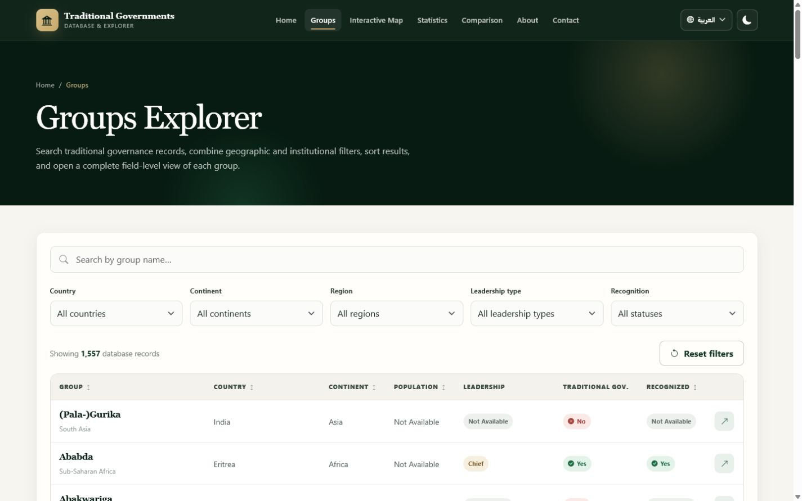<br>
      <strong>Groups Explorer</strong><br>
      Search, geographic and institutional filters, sorting, server-side pagination, URL state, and detailed records.
    </td>
    <td width="50%" align="center">
      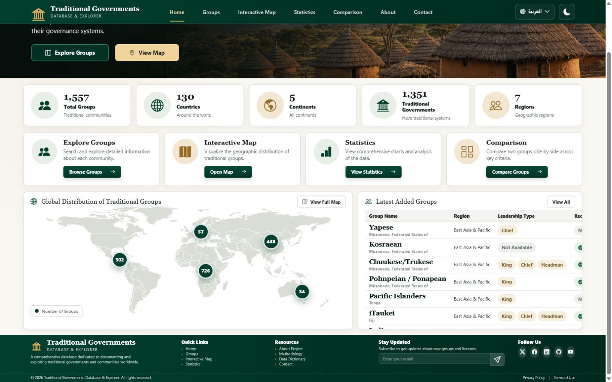<br>
      <strong>Interactive Map</strong><br>
      A responsive world map with live continent totals and direct links into filtered group results.
    </td>
  </tr>
  <tr>
    <td width="50%" align="center">
      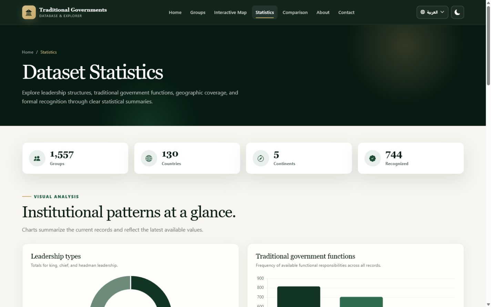<br>
      <strong>Statistics Dashboard</strong><br>
      All-data, country, continent, and region scopes update leadership, functions, recognition, distributions, largest groups, and top-country charts.
    </td>
    <td width="50%" align="center">
      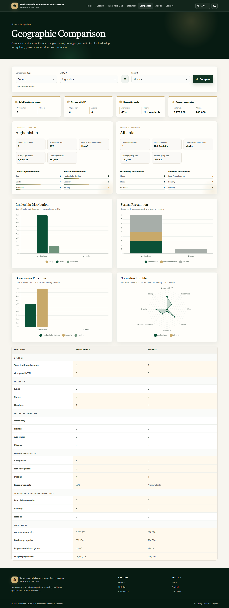<br>
      <strong>Comparison View</strong><br>
      Two real records compared across geography, leadership, functions, administrative structure, and recognition.
    </td>
  </tr>
  <tr>
    <td width="50%" align="center">
      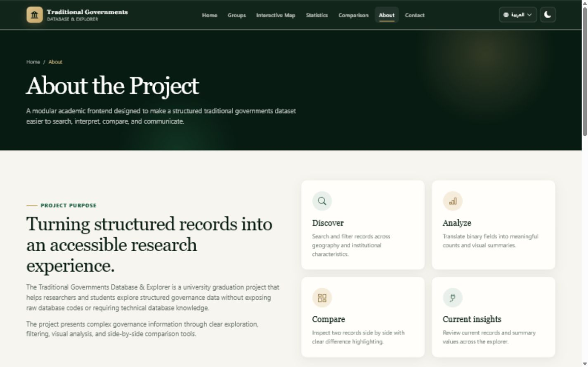<br>
      <strong>About Project</strong><br>
      Project purpose, academic methodology, value handling, supported data fields, and research-oriented workflows.
    </td>
    <td width="50%" align="center">
      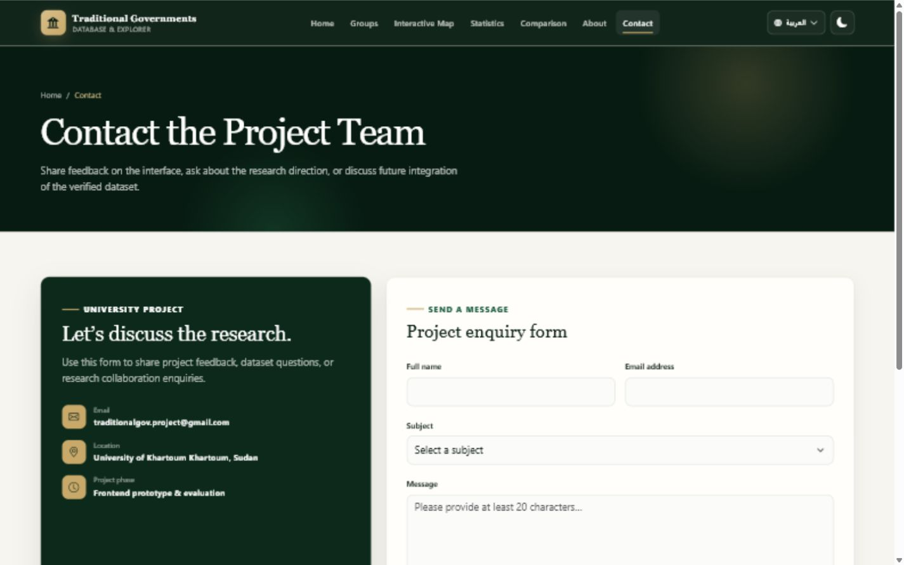<br>
      <strong>Contact Form</strong><br>
      An accessible enquiry form connected to <code>POST /api/contact</code> without storing messages in the database.
    </td>
  </tr>
  <tr>
    <td width="50%" align="center">
      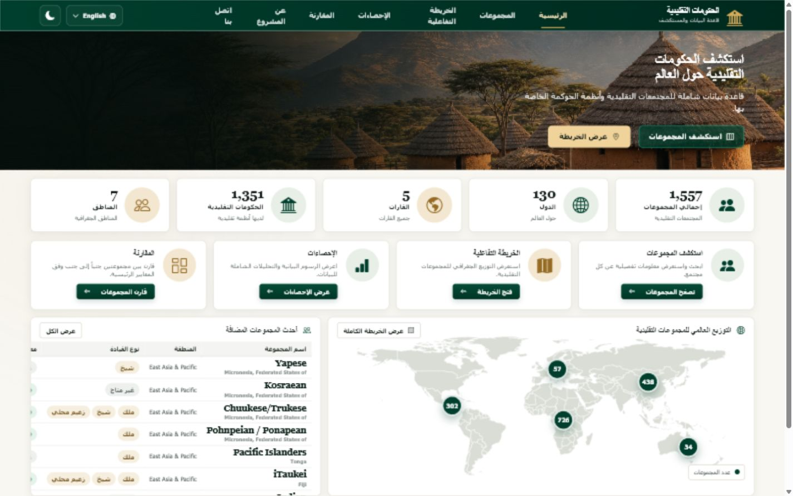<br>
      <strong>Arabic RTL Interface</strong><br>
      Translated controls, correct RTL layout, bidirectional group-name handling, and saved language preference.
    </td>
    <td width="50%" align="center">
      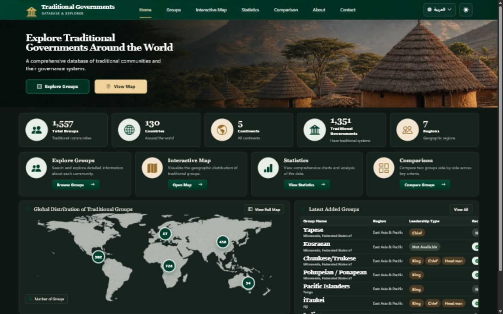<br>
      <strong>Dark Mode</strong><br>
      Saved theme preference with consistent contrast across navigation, cards, tables, maps, forms, and charts.
    </td>
  </tr>
</table>

## Interactive Geographic Statistics

The Statistics page is an interactive analysis workspace backed by
`GET /api/statistics`. Its **Analyze by** control supports four scopes:

| Scope | Request behavior | Geographic chart |
|---|---|---|
| **All Data** | No geographic query parameter | Distribution by continent |
| **Country** | Exact `country` value | Marked as not applicable for the single-country scope |
| **Continent** | Exact `continent` value | Distribution by region |
| **Region** | Exact `region` value | Distribution by country |

Selecting a location updates summary cards, leadership types, governance
functions, recognition, geographic distribution, largest groups, and top
countries without reloading the page. The selection is stored in the page URL,
so a filtered statistics view can be refreshed or shared.

The implementation is designed to minimize browser and database work:

- each valid statistics change sends exactly **one** combined statistics API
  request;
- Flask validates that only one geographic scope is active;
- MySQL performs every count, group, ranking, and aggregate calculation;
- JavaScript normalizes the returned JSON and updates the current view;
- existing Chart.js instances are reused through `chart.update()` instead of
  creating replacement canvases;
- an `AbortController` prevents a superseded response from overwriting newer
  results;
- empty, inapplicable, loading, and error states preserve the existing page
  layout.

## How to Run Locally

### Requirements

- [Git](https://git-scm.com/downloads)
- [Python 3.11+](https://www.python.org/downloads/)
- MySQL 8.x, or valid credentials for the hosted project database
- A modern browser
- Optional: Visual Studio Code with the **Live Server** extension

### 1. Clone the repository

```bash
git clone https://github.com/mussabtaha/Traditional-Governance-Data-Analytics-and-Visualization-Platform.git
cd Traditional-Governance-Data-Analytics-and-Visualization-Platform
```

### 2. Create the Flask environment

```bash
cd backend-flask
python -m venv .venv
```

Activate it on Windows PowerShell:

```powershell
.\.venv\Scripts\Activate.ps1
```

Windows Command Prompt:

```bat
.venv\Scripts\activate.bat
```

macOS or Linux:

```bash
source .venv/bin/activate
```

### 3. Install backend dependencies

```bash
python -m pip install --upgrade pip
python -m pip install -r requirements.txt
```

### 4. Configure environment variables

Copy the safe template:

```powershell
Copy-Item .env.example .env
```

On macOS or Linux:

```bash
cp .env.example .env
```

Then provide the MySQL and optional contact-email settings:

```dotenv
DB_HOST=your_mysql_host
DB_PORT=3306
DB_USER=your_mysql_user
DB_PASSWORD=your_mysql_password
DB_NAME=tradgov_db
PORT=3000
RESEND_API_KEY=your_resend_api_key
CONTACT_EMAIL=destination@example.com
FROM_EMAIL=Traditional Governance <contact@your-verified-domain.example>
```

Never commit `.env` or expose real credentials in frontend files.

### 5. Run the Flask API

From `backend-flask`:

```bash
python app.py
```

The development API runs at `http://127.0.0.1:3000`. Verify it with:

```text
http://127.0.0.1:3000/api/health
```

### 6. Run the static frontend

Open a second terminal at the repository root. Use VS Code Live Server, or:

```bash
python -m http.server 5500 --bind 127.0.0.1
```

Open:

```text
http://127.0.0.1:5500/index.html
```

When the frontend is served from `localhost` or `127.0.0.1`, the shared
JavaScript automatically uses the matching local Flask API on port `3000`.
Production deployments use:

```text
https://traditional-governance-data-analytics.onrender.com/api
```

Do not open the HTML files through `file:///`; an HTTP origin is required for
consistent `fetch()` and CORS behavior.

<p align="center">
  
</p>

## API Documentation

**Base URL**

```text
https://traditional-governance-data-analytics.onrender.com/api
```

All successful endpoints use:

```json
{
  "success": true,
  "data": {}
}
```

Errors use a non-2xx HTTP status with:

```json
{
  "success": false,
  "message": "A user-readable error message."
}
```

### Endpoint reference

| Method | Path | Purpose | Parameters | Example |
|---|---|---|---|---|
| `GET` | `/api/health` | Check Flask and database availability | None | [`/api/health`](https://traditional-governance-data-analytics.onrender.com/api/health) |
| `GET` | `/api/stats` | Return overall counts, recognition, functions, and coverage totals | None | [`/api/stats`](https://traditional-governance-data-analytics.onrender.com/api/stats) |
| `GET` | `/api/statistics` | Return one combined statistics payload for all data or one geographic scope | Optional `country`, `continent`, or `region` | `/api/statistics?continent=Africa` |
| `GET` | `/api/countries` | Return country summary rows ordered by group total | None | [`/api/countries`](https://traditional-governance-data-analytics.onrender.com/api/countries) |
| `GET` | `/api/continents` | Return group totals by continent | None | [`/api/continents`](https://traditional-governance-data-analytics.onrender.com/api/continents) |
| `GET` | `/api/regions` | Return group totals by region | None | [`/api/regions`](https://traditional-governance-data-analytics.onrender.com/api/regions) |
| `GET` | `/api/leadership` | Return king, chief, and headman totals | None | [`/api/leadership`](https://traditional-governance-data-analytics.onrender.com/api/leadership) |
| `GET` | `/api/largest-groups` | Return the ten largest records with a population value | None | [`/api/largest-groups`](https://traditional-governance-data-analytics.onrender.com/api/largest-groups) |
| `GET` | `/api/top-countries` | Return the ten countries with the most group records | None | [`/api/top-countries`](https://traditional-governance-data-analytics.onrender.com/api/top-countries) |
| `GET` | `/api/group-options` | Return lightweight ID/name/country rows for comparison selectors | None | [`/api/group-options`](https://traditional-governance-data-analytics.onrender.com/api/group-options) |
| `GET` | `/api/groups` | Return one filtered, sorted, paginated group page | Query parameters below | [`/api/groups?page=1&limit=100`](https://traditional-governance-data-analytics.onrender.com/api/groups?page=1&limit=100) |
| `GET` | `/api/groups/<id>` | Return one complete group record | Positive integer path ID | [`/api/groups/1`](https://traditional-governance-data-analytics.onrender.com/api/groups/1) |
| `POST` | `/api/contact` | Validate and deliver a contact message by email | JSON: `name`, `email`, `subject`, `message` | No database write |

### `/api/statistics` geographic analysis

The Statistics page uses one combined endpoint for summary counts, recognition,
leadership, functions, context-aware geographic distribution, largest groups,
and top countries. Supply at most one exact database value:

| Parameter | Value | Rule |
|---|---|---|
| `country` | Exact country value | Cannot be combined with `continent` or `region` |
| `continent` | Exact continent value | Cannot be combined with `country` or `region` |
| `region` | Exact region value | Cannot be combined with `country` or `continent` |

```http
GET /api/statistics
GET /api/statistics?country=Kenya
GET /api/statistics?continent=Africa
GET /api/statistics?region=Sub-Saharan%20Africa
```

The geographic chart adapts to the selected scope: all data shows continents, a
continent shows regions, and a region shows countries. Country scope keeps the
same chart layout and reports geographic distribution and top countries as not
applicable. Unknown, empty, or conflicting scope parameters return the standard
`400` error envelope. Values are validated against MySQL, filter values are
parameterized, and query identifiers come only from a server-side whitelist.

For example, this request is rejected with HTTP `400` because two geographic
scopes conflict:

```http
GET /api/statistics?country=Kenya&continent=Africa
```

### Contact email delivery

Contact form messages are delivered through the Resend HTTPS Email API and are
**not stored in MySQL or any other database**. Configure `RESEND_API_KEY`,
`CONTACT_EMAIL`, and `FROM_EMAIL` in the local backend `.env` file and as
secret environment variables in the Render backend service. `FROM_EMAIL` must
use a sender address on a domain verified in Resend.

Render Free blocks direct outbound SMTP ports, so the project uses Resend over
HTTPS instead of SMTP. The browser never receives or stores the Resend API key.

`RESEND_API_KEY` is a secret: never place a real API key in source code, README
examples, screenshots, commits, or frontend JavaScript.

For deployment, verify a sender domain in the
[Resend Domains dashboard](https://resend.com/docs/dashboard/domains/introduction),
create a sending-access key in the
[Resend API Keys dashboard](https://resend.com/docs/dashboard/api-keys/introduction),
and add the following environment variables to the Render backend service:

```dotenv
RESEND_API_KEY=your_resend_api_key
CONTACT_EMAIL=destination@example.com
FROM_EMAIL=Traditional Governance <contact@your-verified-domain.example>
```

### `/api/groups` query parameters

| Parameter | Accepted values | Behavior |
|---|---|---|
| `page` | Positive integer; default `1` | Requested result page |
| `limit` | `1`–`100`; default `20` | Records returned per page |
| `search` | Text | Searches `group_name`, `group_name_ar`, and `country` |
| `country` | Exact country value | SQL country filter |
| `continent` | Exact continent value | SQL continent filter |
| `region` | Exact region value | SQL region filter |
| `leadership` | `King`, `Chief`, `Headman` | Requires the selected leadership column to equal `1` |
| `recognition` | `1`, `0`, `missing` | Filters `formackn` |
| `any_tpi` | `1`, `0`, `missing` | Filters traditional institution availability |
| `sort` | `id`, `GroupName`, `country`, `continent`, `region`, `population`, `FormAckn` and supported aliases | Whitelisted SQL sort field |
| `direction` | `asc`, `desc` | Sort direction |

Example request:

```http
GET /api/groups?page=1&limit=100&continent=Africa&leadership=Chief&recognition=1&sort=Population&direction=desc
```

Paginated response shape:

```json
{
  "success": true,
  "data": {
    "groups": [
      {
        "id": 1,
        "country": "Example country",
        "continent": "Africa",
        "region": "Example region",
        "group_name": "Example group",
        "group_name_ar": null,
        "any_tpi": 1
      }
    ],
    "pagination": {
      "page": 1,
      "limit": 100,
      "total_items": 726,
      "total_pages": 8
    }
  }
}
```

<details>
<summary><strong>Additional short response examples</strong></summary>

Health:

```json
{
  "success": true,
  "data": {
    "backend": "connected",
    "database": "connected"
  }
}
```

Continent summaries:

```json
{
  "success": true,
  "data": [
    {
      "continent": "Africa",
      "total_groups": 726
    }
  ]
}
```

Comparison options:

```json
{
  "success": true,
  "data": [
    {
      "id": 1,
      "group_name": "Example group",
      "group_name_ar": null,
      "country": "Example country"
    }
  ]
}
```

Single group:

```json
{
  "success": true,
  "data": {
    "id": 1,
    "groupid": 2001012,
    "group_name": "Example group",
    "group_name_ar": null,
    "country": "Example country",
    "any_tpi": 1,
    "formackn": 1
  }
}
```

</details>

## Server-Side Pagination and Filtering

The first frontend implementation downloaded every Groups API page and combined
all records in JavaScript. As the database and network distance increased, that
approach produced unnecessary requests, longer waits, and excessive browser
memory use.

The current implementation uses proper server-side pagination:

- the first Groups-page data request is `/groups?page=1&limit=100`;
- pages 2–16 are not requested during initial loading;
- selecting another page requests only that page;
- search, country, continent, region, leadership, recognition, TPI, sort, and
  direction values are sent as query parameters;
- Flask validates the parameters and uses whitelisted field mappings;
- MySQL executes filtering, sorting, total counting, `LIMIT`, and `OFFSET`;
- the response provides `page`, `limit`, `total_items`, and `total_pages`;
- the browser stores only the current page of full group records;
- comparison selectors use lightweight option rows, while full records are
  requested by ID only when selected;
- `AbortController` cancels superseded explorer requests, and a controller
  identity check prevents stale responses from replacing newer results.

This design reduces network traffic, improves Railway/Render performance, keeps
the interface responsive, and scales more effectively than downloading the
entire dataset on every visit.

## Project Structure

```text
Traditional-Governance-Data-Analytics-and-Visualization-Platform/
├── index.html                       # Home dashboard and interactive map
├── groups.html                      # Search, filters, table, details, pagination
├── statistics.html                  # Geographic filters, summary cards, and charts
├── comparison.html                  # Side-by-side group comparison
├── about.html                       # Project purpose and field information
├── contact.html                     # Email-backed project enquiry form
├── css/
│   ├── home.css                     # Homepage-specific layout and map styling
│   └── style.css                    # Shared components, themes, RTL, responsiveness
├── js/
│   ├── preferences.js               # Early global language/theme persistence
│   ├── i18n.js                      # English/Arabic translation behavior
│   └── script.js                    # API, rendering, charts, filters, comparison
├── assets/
│   ├── images/
│   │   ├── hero-village.png
│   │   └── world-map.svg
│   ├── icons/
│   ├── readme/
│   │   ├── header.svg
│   │   ├── system-architecture.svg
│   │   ├── platform-workflow.svg
│   │   ├── local-run-workflow.svg
│   │   ├── deployment-flow.svg
│   │   └── step-*.svg                  # Six terminal command illustrations
│   ├── screenshots/
│   │   ├── home-dashboard.png
│   │   ├── groups-explorer.png
│   │   ├── interactive-map.png
│   │   ├── statistics-dashboard.png
│   │   ├── comparison-view.png
│   │   ├── about-project.png
│   │   ├── contact-page.png
│   │   ├── arabic-interface.png
│   │   ├── dark-mode.png
│   │   └── README.md                # Authentic screenshot capture guide
│   ├── vendor/                      # Local Bootstrap, icons, fonts, and Chart.js
│   └── world-countries.geojson
├── data/
│   └── groups.json                  # Legacy/sample frontend data; active UI uses API
├── backend-flask/
│   ├── app.py                       # Flask factory, CORS, errors, application entry
│   ├── config.py                    # Environment-backed settings
│   ├── requirements.txt             # Python dependencies
│   ├── .env.example                 # Safe local configuration template
│   ├── database/
│   │   └── db.py                    # Lazy MySQL pool and query helpers
│   ├── routes/
│   │   └── api.py                   # REST endpoints and SQL filters
│   ├── migrations/
│   │   ├── 001_add_group_name_ar.sql
│   │   ├── 002_fix_confirmed_group_name_encoding.sql
│   │   ├── encoding_diagnosis_report.md
│   │   └── reviewed_arabic_group_names.sql
│   ├── scripts/
│   │   ├── encoding_diagnosis.py
│   │   └── apply_encoding_repairs.py
│   └── tests/
│       ├── test_statistics.py
│       ├── test_server_pagination.py
│       └── test_contact.py
└── .gitignore
```

Generated folders, credentials, virtual environments, Git internals, and
temporary files are intentionally omitted.

## Detailed Windows Setup

This guide starts from a clean Windows computer. It runs the Flask backend and
static frontend locally while using valid credentials for the existing Railway
database.

<details>
<summary><strong>Open the complete Windows setup and troubleshooting guide</strong></summary>

### A. Required software

Install:

- [Git for Windows](https://git-scm.com/download/win)
- [Python](https://www.python.org/downloads/) — Python 3.11 or 3.12 is recommended
- [Visual Studio Code](https://code.visualstudio.com/)
- the VS Code **Live Server** extension, or Python's built-in HTTP server
- a modern browser such as Chrome, Edge, or Firefox

The following applications are **not required** to run the project:

- Node.js;
- HeidiSQL;
- a local MySQL server, when valid Railway credentials are available.

### B. Clone the repository

Open PowerShell:

```powershell
git clone https://github.com/mussabtaha/Traditional-Governance-Data-Analytics-and-Visualization-Platform.git
cd Traditional-Governance-Data-Analytics-and-Visualization-Platform
```

### C. Enter the Flask backend

```powershell
cd backend-flask
```

### D. Create a new virtual environment

```powershell
python -m venv .venv
```

Create a new `.venv` on each computer. Do not copy or reuse a virtual
environment created on another computer because its paths and installed
binaries are machine-specific.

### E. Activate the environment

PowerShell:

```powershell
.\.venv\Scripts\Activate.ps1
```

If PowerShell blocks the activation script:

```powershell
Set-ExecutionPolicy -Scope Process -ExecutionPolicy Bypass
.\.venv\Scripts\Activate.ps1
```

The policy change above affects only the current PowerShell process.

Command Prompt alternative:

```bat
.venv\Scripts\activate.bat
```

### F. Install dependencies

```powershell
python -m pip install --upgrade pip
python -m pip install -r requirements.txt
```

### G. Create the `.env` file

PowerShell:

```powershell
Copy-Item .env.example .env
```

Command Prompt alternative:

```bat
copy .env.example .env
```

Open `.env` and enter credentials supplied securely by the project owner:

```dotenv
DB_HOST=
DB_PORT=
DB_USER=
DB_PASSWORD=
DB_NAME=tradgov_db
PORT=3000
RESEND_API_KEY=your_resend_api_key
CONTACT_EMAIL=destination_email_address
FROM_EMAIL=verified_sender_email_address
```

| Variable | Purpose |
|---|---|
| `DB_HOST` | Railway MySQL host |
| `DB_PORT` | Railway MySQL port |
| `DB_USER` | MySQL user |
| `DB_PASSWORD` | MySQL password |
| `DB_NAME` | Database name, normally `tradgov_db` |
| `PORT` | Local Flask port |
| `RESEND_API_KEY` | Secret API key used only by Flask to call Resend over HTTPS |
| `CONTACT_EMAIL` | Destination address that receives contact messages |
| `FROM_EMAIL` | Sender address on a domain verified in Resend |

> **Never commit `.env` to GitHub.** The project owner must share valid
> database credentials securely and separately, never in Git, email screenshots,
> public chat, or README examples.

### H. Run the backend

From `backend-flask`, with `.venv` active:

```powershell
python app.py
```

Expected local backend:

```text
http://127.0.0.1:3000
```

Verify the API in a browser:

```text
http://127.0.0.1:3000/api/stats
```

Or verify it in PowerShell:

```powershell
Invoke-WebRequest -UseBasicParsing http://127.0.0.1:3000/api/stats
```

### I. Run the frontend

Keep Flask running and open a second terminal or VS Code window at the
repository root.

#### Method 1 — VS Code Live Server

1. Open the repository root in VS Code.
2. Open `index.html`.
3. Click **Go Live**.
4. Confirm that the browser opens:

```text
http://127.0.0.1:5500/index.html
```

#### Method 2 — Python static server

From the repository root:

```powershell
python -m http.server 5500
```

Then open:

```text
http://127.0.0.1:5500/index.html
```

Do not open pages directly with a `file:///` URL. An HTTP server gives the
frontend a valid origin for API and CORS behavior.

### J. API base URL selection

The shared JavaScript selects the API base URL by environment:

- frontend on `localhost` → `http://localhost:3000/api`;
- frontend on `127.0.0.1` → `http://127.0.0.1:3000/api`;
- deployed frontend → `https://traditional-governance-data-analytics.onrender.com/api`.

An explicit `window.TRADGOV_CONFIG.apiBaseUrl` remains available for controlled
testing, but normal local development does not require editing any HTML file.

### K. Complete run order

1. Install Python and Git.
2. Clone the repository.
3. Create a new `.venv`.
4. Activate `.venv`.
5. Install `requirements.txt`.
6. Create `.env` and enter securely supplied credentials.
7. Run Flask with `python app.py`.
8. Run Live Server or `python -m http.server 5500`.
9. Open the frontend in a browser.
10. Verify `/api/stats` and confirm that the UI displays live records.

### L. Common problems and fixes

<details>
<summary><strong>Open the Windows troubleshooting table</strong></summary>

| Problem | Direct solution |
|---|---|
| `python` is not recognized | Install Python from python.org, enable **Add Python to PATH**, reopen the terminal, or try `py` instead of `python`. |
| `git` is not recognized | Install Git for Windows and reopen PowerShell or VS Code. |
| `Activate.ps1` is not recognized | Confirm that the terminal is inside `backend-flask` and that `.venv` was created successfully. |
| PowerShell execution-policy error | Run `Set-ExecutionPolicy -Scope Process -ExecutionPolicy Bypass`, then activate again. |
| `.venv` is missing | Run `python -m venv .venv` inside `backend-flask`; do not copy another person's environment. |
| `.env` is missing | Run `Copy-Item .env.example .env`, then add valid credentials. |
| Database connection error | Check `DB_HOST`, `DB_PORT`, `DB_USER`, `DB_PASSWORD`, Railway availability, and whether the credentials are still valid. This is different from a route 404. |
| CORS error | Confirm that the frontend origin exactly matches an origin in Flask's `ALLOWED_ORIGINS`. Include scheme, host, and port. |
| `gunicorn: command not found` | Activate `.venv` and reinstall `requirements.txt`. On Windows, use `python app.py`; Gunicorn is the Render/Linux production server. |
| `Endpoint not found` | The backend root `/` has no route, so its 404 is normal. Test `/api/stats` or `/api/health`. |
| Render service is slow initially | A sleeping free service may take a short time to wake. Wait and retry the API endpoint. |
| Frontend loads but data is missing | Test the configured API `/api/stats`, inspect the browser console/network panel, confirm the API base URL, and distinguish API/CORS errors from database failures. |

</details>

</details>

## Deployment

<p align="center">
  
</p>

| Platform | Responsibility |
|---|---|
| GitHub | Source control for the frontend, Flask backend, migrations, tests, and documentation |
| Render Static Site | Hosts the public frontend at [traditional-governance-frontend.onrender.com](https://traditional-governance-frontend.onrender.com) |
| Render Web Service | Hosts the Flask API at [traditional-governance-data-analytics.onrender.com](https://traditional-governance-data-analytics.onrender.com/api/health) |
| Railway | Hosts the MySQL database |
| Resend | Delivers Contact-page messages through an HTTPS email API without storing them in MySQL |

### Backend — Render Web Service

Create a Render **Web Service** connected to the GitHub repository:

| Setting | Value |
|---|---|
| Root directory | `backend-flask` |
| Runtime | Python |
| Build command | `pip install -r requirements.txt` |
| Start command | `gunicorn app:app` |
| Health endpoint | `/api/health` |

Add the MySQL, `PORT`, and optional Resend variables from `.env.example` to
Render's environment settings. Never upload the local `.env` file.

### Frontend — Render Static Site

Create a Render **Static Site** from the repository root:

| Setting | Value |
|---|---|
| Root directory | Repository root |
| Build command | None required |
| Publish directory | `.` |

The deployed frontend's API URL must resolve to:

```text
https://traditional-governance-data-analytics.onrender.com/api
```

The browser loads the static frontend from Render and sends `fetch()` requests
to the Render Flask service. Flask connects securely to Railway using
environment variables stored in the hosting environment.

The current Flask-CORS configuration explicitly permits:

```text
http://localhost:5500
http://127.0.0.1:5500
https://traditional-governance-frontend.onrender.com
```

The production frontend origin must remain in Flask's allowed-origin list.
Changing the frontend domain or adding a custom domain requires adding that
exact new origin and redeploying the backend.

## Testing and Verification

The repository currently contains 17 Flask contract tests covering:

- combined SQL filtering, sorting, and pagination;
- missing recognition values;
- out-of-range page totals;
- invalid leadership rejection;
- invalid sort-direction rejection;
- the lightweight comparison-options endpoint;
- all-data, country, continent, and region statistics responses;
- empty statistics results and context-aware distributions;
- conflicting, empty, and unknown statistics-scope rejection;
- parameterized statistics values and bounded query counts without N+1 queries;
- valid contact email construction and one mocked Resend HTTPS request;
- contact input validation and maximum lengths;
- missing Resend configuration and safe provider failure responses;
- confirmation that contact delivery performs no database operation.

Run them from `backend-flask` after configuring the environment:

```powershell
python -m unittest discover -s tests -t .
```

Useful verification commands:

```powershell
# Python syntax
python -m compileall app.py config.py database routes tests

# Shared frontend JavaScript syntax
node --check ..\js\script.js

# Local API health
Invoke-WebRequest -UseBasicParsing http://localhost:3000/api/health

# Production statistics response
Invoke-WebRequest -UseBasicParsing `
  https://traditional-governance-data-analytics.onrender.com/api/stats
```

Checks performed during the documented refactor included HTTP 200 verification,
database row-count verification, pagination metadata checks, SQL-filter tests,
page-change tests, filter-reset tests, CORS response checks, and browser-console
inspection.

No GitHub Actions or other automated CI/CD workflow is currently present, so
this README does not claim continuous integration.

## Security Notes

- Store database credentials only in environment variables.
- Keep `.env` in `.gitignore`; never commit it.
- Do not commit `.venv`, `__pycache__`, local logs, or credential exports.
- Keep user-supplied values in parameterized SQL queries.
- Keep sort and leadership fields restricted to server-side allowlists.
- Store production secrets in Render and Railway environment settings.
- Keep `RESEND_API_KEY` only in backend environment variables; never commit it
  or expose it to frontend code.
- Rotate database credentials immediately if they are exposed.
- Never place real credentials, private hosts, or secret URLs in README examples.
- Keep local and production CORS origins explicit; add new domains only after review.
- The dataset API remains read-only. The only `POST` route is `/api/contact`,
  which sends an email and does not write to the database.


## Contributing

Academic collaborators and external contributors should use the standard Git
review workflow:

1. Fork the repository or create a branch in an authorized clone.
2. Create a focused branch:

   ```bash
   git checkout -b feature/short-description
   ```

3. Make one logically scoped change and preserve the existing bilingual,
   responsive, and API contracts.
4. Run the relevant checks:

   ```bash
   cd backend-flask
   python -m unittest discover -s tests -v
   python -m compileall app.py config.py database routes tests
   node --check ../js/script.js
   node --check ../js/i18n.js
   ```

5. Review `git diff`, ensure no secrets or generated environments are included,
   and write a clear commit message.
6. Push the branch and open a pull request describing the change, tests, and
   any deployment or database implications.

Please keep pull requests small, do not commit `.env` or `.venv`, and do not
alter the database schema or API response contracts without project-team
review.

## Authors

This platform was developed as a university **Graduation Project** by:

| Name | Student ID  | GitHub |
|---|---|---|
| Rashed Al-Bashir | 20-204 | [@RashidAlbashir](https://github.com/RashidAlbashir) |
| Malaz Ibrahim | 17-229 | [@malazibrahim203-design ](https://github.com/malazibrahim203-design) |
| Musab Taha Ahmed | 20-312 | [@mussabtaha](https://github.com/mussabtaha) |

Additional team details should be added only after the relevant member confirms
their preferred name and public profile.

## Academic Information

| Item | Details |
|---|---|
| University | _University of Khartoum_ |
| Faculty | _school of math_ |
| Department | _CS / CS & ST_ |
| Supervisor | _Safa M.Ahmed_ |
| Academic year | _2026 / 2027_ |
| project title | _Traditional Governance Data Analytics and Visualization Platform_ |

## Future Improvements

- Add advanced descriptive and longitudinal analytics.
- Export individual charts as publication-ready images.
- Add filtered CSV export for research workflows.
- Generate PDF reports with selected statistics and comparison results.
- Add optional role-based authentication for future administrative workflows.
- Investigate machine-learning predictions only where methodologically and
  ethically appropriate.
- Expand configurable interactive dashboards for researchers.
- Add a custom domain for the deployed frontend.
- Add uptime monitoring for the Render frontend and API.
- Add automated deployment and post-deployment health checks.
- Add more reviewed screenshots and a short demonstration video.
- Expand manually reviewed Arabic group names without changing source names.
- Add export and citation features for research workflows.
- Add automated accessibility and cross-browser regression testing.
- Add CI/CD validation for Python, JavaScript, API contracts, and documentation links.
- Add a controlled data-administration workflow if future project scope permits it.
- Document the dataset's approved academic citation and codebook provenance.

These are proposed extensions, not features claimed by the current system.

## Acknowledgements

This project uses open-source technologies including Python, Flask, MySQL
Connector/Python, Flask-CORS, Bootstrap, Bootstrap Icons, and Chart.js.


## License

This repository does not currently include an open-source `LICENSE` file.
Unless the project owners add one, the source and documentation should be
treated as an academic graduation-project submission. Reuse, redistribution,
or publication should be approved by the project team and the relevant
university.

Dataset rights and citation requirements remain subject to the original data
source and institutional guidance.

---

<p align="center">
  <strong>Traditional Governance Data Analytics and Visualization Platform</strong><br>
  Built for transparent exploration, responsible interpretation, and academic analysis.
</p>
