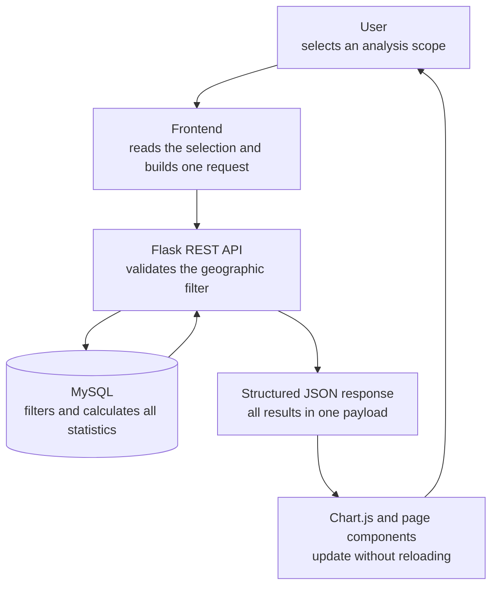

# Interactive Statistics Filtering

## Graduation Defense Technical Explanation Guide

> **Purpose:** This document is written in the first person so I can explain
> the feature naturally during my graduation-project defense. It focuses on
> design decisions, architecture, implementation logic, performance, security,
> and testing—not line-by-line source code.

## Contents / المحتويات

1. [Problem Before the Update](#1-problem-before-the-update)
2. [Design Objective](#2-design-objective)
3. [System Design](#3-system-design)
4. [Backend Changes](#4-backend-changes)
5. [Database Changes](#5-database-changes)
6. [SQL Aggregation](#6-sql-aggregation)
7. [Frontend Changes](#7-frontend-changes)
8. [Chart.js](#8-chartjs)
9. [Performance Improvements](#9-performance-improvements)
10. [Security](#10-security)
11. [Testing](#11-testing)
12. [Why This Design Is Better](#12-why-this-design-is-better)
13. [Possible Questions from the Examiner](#13-possible-questions-from-the-examiner)
14. [Short Presentation Version](#14-short-presentation-version)

---

## 1. Problem Before the Update

### English explanation

Before this update, the Statistics page presented only **global statistics**.
It summarized the complete dataset and showed overall values such as the total
number of groups, leadership distribution, governance functions, formal
recognition, continent distribution, the largest groups, and the countries
with the highest number of records.

That version was useful as a general introduction, but it had an important
limitation: every chart always described the whole database. A researcher could
see the global number of recognized groups, for example, but could not use the
same page to ask, “How many of these groups are in Kenya?” or “What is the
leadership distribution inside Africa?”

This made the page descriptive but not sufficiently exploratory. Practical
research questions require changing the geographic context:

- A researcher studying Africa needs African totals, not only worldwide totals.
- A researcher comparing regions needs the results for each region separately.
- A supervisor may ask whether formal recognition differs between Kenya and
  another country.
- A policy researcher may need the largest groups within one continent instead
  of the largest groups worldwide.

Without interactive filtering, the user had to leave the Statistics page,
inspect records manually, or perform a separate analysis outside the platform.
The interface displayed useful information, but it could not answer focused
geographic questions directly.

### الشرح بالعربية

قبل هذا التحديث كانت صفحة الإحصاءات تعرض **إحصاءات عامة فقط** لجميع سجلات
قاعدة البيانات. كانت الصفحة توضح العدد الكلي للمجموعات، وتوزيع أنواع القيادة،
ووظائف الحوكمة التقليدية، وحالة الاعتراف الرسمي، والتوزيع حسب القارات، وأكبر
المجموعات، وأكثر الدول التي تحتوي على سجلات.

كانت هذه الصفحة مفيدة لتقديم نظرة عامة، ولكنها كانت تعاني من مشكلة أساسية:
جميع الرسوم البيانية كانت تصف قاعدة البيانات كاملة دائماً. على سبيل المثال،
كان الباحث يستطيع معرفة العدد العالمي للمجموعات المعترف بها، لكنه لا يستطيع
من الصفحة نفسها أن يسأل: «كم عدد هذه المجموعات في كينيا؟» أو «كيف تتوزع أنواع
القيادة داخل أفريقيا؟».

لذلك كانت الصفحة وصفية أكثر من كونها أداة استكشاف وتحليل. فالأسئلة البحثية
العملية تحتاج إلى تغيير النطاق الجغرافي:

- الباحث الذي يدرس أفريقيا يحتاج إلى إحصاءات أفريقيا وليس الإحصاءات العالمية فقط.
- الباحث الذي يقارن المناطق يحتاج إلى نتائج كل منطقة بصورة مستقلة.
- قد يسأل المشرف عن اختلاف الاعتراف الرسمي بين كينيا ودولة أخرى.
- قد يحتاج الباحث إلى معرفة أكبر المجموعات داخل قارة معينة بدلاً من أكبر
  المجموعات في العالم.

بدون التصفية التفاعلية كان المستخدم مضطراً إلى مغادرة صفحة الإحصاءات أو فحص
السجلات يدوياً أو إجراء تحليل خارجي. لذلك كان الهدف من التحديث هو تحويل الصفحة
من شاشة عرض عامة إلى أداة تحليل جغرافي تفاعلية.

---

## 2. Design Objective

### English explanation

My objective was to allow the user to analyze the same dataset at different
geographic levels while keeping the interface simple. I designed four analysis
scopes:

1. **All Data**
2. **Country**
3. **Continent**
4. **Region**

When the user selects a location, every relevant value on the page updates:
summary cards, recognition, leadership, governance functions, geographic
distribution, largest groups, and top countries.

This is more useful for researchers because it supports movement from a broad
question to a focused question. A user can begin with the global view, narrow
the analysis to Africa, then examine one country or one region. The interface
therefore supports exploration without requiring database knowledge.

I deliberately did **not** create a separate HTML page for every country,
continent, or region. The dataset currently contains about 130 countries. A
separate page for every location would duplicate layout and JavaScript, make
maintenance difficult, and create inconsistent pages when the design changes.
It would also not scale when a new country or region is added to the database.

Instead, I built one reusable Statistics page. The selected scope changes the
data, while the page structure remains the same. This design is easier to
maintain, more consistent for the user, and automatically supports new database
values.

### الشرح بالعربية

كان هدفي هو تمكين المستخدم من تحليل مجموعة البيانات نفسها على مستويات
جغرافية مختلفة مع الحفاظ على واجهة بسيطة. لذلك صممت أربعة نطاقات للتحليل:

1. **جميع البيانات**
2. **الدولة**
3. **القارة**
4. **المنطقة**

عندما يختار المستخدم موقعاً جغرافياً، تتحدث جميع القيم المهمة في الصفحة:
بطاقات الملخص، والاعتراف الرسمي، وأنواع القيادة، ووظائف الحوكمة، والتوزيع
الجغرافي، وأكبر المجموعات، وأكثر الدول.

هذا الأسلوب أكثر فائدة للباحث لأنه يسمح بالانتقال من سؤال عام إلى سؤال محدد.
يمكن للمستخدم أن يبدأ بالتحليل العالمي، ثم ينتقل إلى أفريقيا، ثم يركز على دولة
أو منطقة معينة، وكل ذلك دون الحاجة إلى معرفة تقنية بقاعدة البيانات.

تعمدت **عدم إنشاء صفحة مستقلة لكل دولة أو قارة أو منطقة**. تحتوي البيانات على
نحو 130 دولة، وإنشاء صفحة لكل دولة يعني تكرار التصميم والبرمجيات وصعوبة
الصيانة. كما أن إضافة دولة جديدة إلى قاعدة البيانات كانت ستتطلب إنشاء صفحة
جديدة يدوياً.

بدلاً من ذلك أنشأت صفحة إحصاءات واحدة قابلة لإعادة الاستخدام. يتغير محتوى
البيانات حسب الاختيار، بينما يبقى هيكل الصفحة ثابتاً. هذا يجعل النظام أسهل في
الصيانة وأكثر اتساقاً وقابلاً للتوسع.

---

## 3. System Design

### Complete workflow



### English explanation

I designed the feature as a clear six-stage workflow:

#### Step 1 — User

The user chooses **All Data**, **Country**, **Continent**, or **Region**. If a
geographic category is selected, a second dropdown displays valid values loaded
from the database, such as Africa, Kenya, or Sub-Saharan Africa.

#### Step 2 — Frontend

JavaScript reads the selected scope and value. It creates one URL such as:

```text
/api/statistics?continent=Africa
```

The frontend then shows a loading state and sends one asynchronous request. The
page does not reload, and it does not download all group records.

#### Step 3 — Flask API

Flask receives the request. It checks that the filter name is supported, that
the value is not empty, that only one geographic filter was supplied, and that
the selected value exists in the database. Invalid requests are rejected
before statistical queries are executed.

#### Step 4 — MySQL

After validation, Flask sends parameterized queries to MySQL. MySQL applies the
selected geographic condition and calculates summary totals, recognition,
leadership, governance functions, geographic distribution, largest groups, and
top countries.

#### Step 5 — JSON

Flask organizes the results into one structured JSON response. JSON is the
data-exchange format between the backend and frontend. It contains named
sections, so JavaScript can clearly distinguish summary data, leadership data,
recognition data, and chart lists.

#### Step 6 — Chart.js and interface

JavaScript normalizes the response, updates the summary cards, updates the
current-scope label, and passes the new values to the existing Chart.js
instances. Chart.js redraws the charts smoothly by using `chart.update()`.

### الشرح بالعربية

صممت الميزة كسير عمل واضح يتكون من ست مراحل:

#### الخطوة الأولى — المستخدم

يختار المستخدم «جميع البيانات» أو «الدولة» أو «القارة» أو «المنطقة». وعند
اختيار تصنيف جغرافي يظهر حقل ثانٍ يحتوي على القيم الصحيحة القادمة من قاعدة
البيانات مثل أفريقيا أو كينيا أو أفريقيا جنوب الصحراء.

#### الخطوة الثانية — الواجهة الأمامية

تقرأ JavaScript نوع النطاق والقيمة المختارة، ثم تنشئ طلباً واحداً مثل:

```text
/api/statistics?continent=Africa
```

بعد ذلك تظهر حالة التحميل، ويُرسل الطلب بصورة غير متزامنة. لا تتم إعادة تحميل
الصفحة ولا يتم تنزيل جميع سجلات المجموعات.

#### الخطوة الثالثة — واجهة Flask

تستقبل Flask الطلب وتتحقق من أن اسم المرشح مسموح، وأن القيمة ليست فارغة، وأن
المستخدم لم يرسل أكثر من مرشح جغرافي في الوقت نفسه، وأن القيمة موجودة فعلاً في
قاعدة البيانات. يتم رفض الطلب غير الصحيح قبل تنفيذ الاستعلامات الإحصائية.

#### الخطوة الرابعة — MySQL

بعد التحقق ترسل Flask استعلامات آمنة إلى MySQL. تقوم MySQL بتطبيق الشرط
الجغرافي ثم تحسب الملخصات، والاعتراف، والقيادة، والوظائف، والتوزيع الجغرافي،
وأكبر المجموعات، وأكثر الدول.

#### الخطوة الخامسة — JSON

تنظم Flask النتائج في استجابة JSON واحدة. تمثل JSON صيغة تبادل البيانات بين
الخلفية والواجهة، وتحتوي على أقسام واضحة لكل نوع من الإحصاءات.

#### الخطوة السادسة — Chart.js والواجهة

تقرأ JavaScript الاستجابة وتحدث بطاقات الملخص وعنوان النطاق والرسوم البيانية.
تستخدم Chart.js الدالة `chart.update()` لإعادة رسم البيانات الجديدة بسلاسة من
دون إعادة إنشاء الصفحة.

---

## 4. Backend Changes

### English explanation

I added a new endpoint:

```http
GET /api/statistics
```

I chose this name because it clearly describes the resource being requested:
statistical analysis. I used the HTTP `GET` method because the request only
reads data; it does not create, edit, or delete database records.

The endpoint accepts one optional geographic parameter:

- `country`
- `continent`
- `region`

With no parameter, it returns the All Data view. With one parameter, it returns
statistics for that geographic scope.

I chose **one combined endpoint** instead of separate endpoints such as
`/statistics/leadership`, `/statistics/recognition`, and
`/statistics/functions`. A single endpoint gives the page a consistent
snapshot of the selected scope and requires only one network round trip for
each update. It also centralizes validation and error handling.

The backend performs several validation steps:

1. It accepts only the supported parameter names.
2. It rejects an empty value.
3. It rejects a request containing more than one geographic filter.
4. It checks that the requested geographic value exists in the database.
5. It uses a whitelist to map the accepted filter name to a database column.

Only one geographic filter is accepted because the interface represents one
analysis scope at a time. A request containing both `country=Kenya` and
`continent=Africa` may appear logical, but accepting combinations would make
the API contract more complex and could create contradictory requests such as
`country=Kenya&continent=Asia`. One clear scope is easier to validate, explain,
cache, test, and maintain.

Invalid requests return HTTP `400 Bad Request` with a safe JSON message. This
status tells the frontend that the client request is invalid; it is different
from a server failure.

All user values are passed separately from the SQL text through parameterized
queries. The filter value is treated as data, not as executable SQL.

### الشرح بالعربية

أضفت مساراً جديداً في الخلفية:

```http
GET /api/statistics
```

اخترت هذا الاسم لأنه يصف المورد المطلوب بوضوح، وهو الإحصاءات. واستخدمت طريقة
`GET` لأن الطلب يقرأ البيانات فقط ولا يضيف سجلات أو يعدلها أو يحذفها.

يقبل المسار مرشحاً جغرافياً اختيارياً واحداً:

- `country`
- `continent`
- `region`

عند عدم إرسال مرشح يعيد إحصاءات جميع البيانات، وعند إرسال مرشح واحد يعيد
إحصاءات ذلك النطاق.

اخترت **مساراً واحداً شاملاً** بدلاً من إنشاء مسارات منفصلة للقيادة والاعتراف
والوظائف. المسار الواحد يعطي الصفحة لقطة متسقة للنطاق المختار ويحتاج إلى رحلة
شبكية واحدة فقط عند كل تحديث. كما أنه يوحد التحقق ومعالجة الأخطاء.

تقوم الخلفية بعدة خطوات للتحقق:

1. قبول أسماء المرشحات المسموح بها فقط.
2. رفض القيمة الفارغة.
3. رفض أكثر من مرشح جغرافي في الطلب نفسه.
4. التأكد من وجود القيمة الجغرافية في قاعدة البيانات.
5. استخدام قائمة مسموح بها لربط اسم المرشح بعمود قاعدة البيانات.

أقبل مرشحاً جغرافياً واحداً لأن الواجهة تمثل نطاق تحليل واحداً في كل مرة.
السماح بمرشحات متعددة قد ينتج طلباً متناقضاً مثل كينيا مع قارة آسيا، كما يزيد
تعقيد الاختبار والصيانة.

تعيد الطلبات غير الصحيحة حالة HTTP `400 Bad Request` مع رسالة JSON آمنة. ويتم
تمرير قيم المستخدم إلى الاستعلامات كمعاملات منفصلة، ولذلك تُعامل القيمة
كبيانات وليست كتعليمات SQL.

---

## 5. Database Changes

### English explanation

I added indexes for the columns used most frequently by geographic and
institutional filtering:

- `country`
- `continent`
- `region`
- `country + formackn`
- `continent + formackn`
- `region + formackn`
- `country + any_tpi`
- `continent + any_tpi`
- `region + any_tpi`

An **index** is a database structure that helps MySQL locate matching rows
without scanning every row from the beginning. It is similar to the index at
the end of a book: instead of reading every page to find a topic, we use the
index to go closer to the required location.

The single-column indexes support common geographic searches. For example,
when the user selects Africa, the continent index helps MySQL locate African
records efficiently.

The composite indexes support common combinations. `formackn` represents
formal recognition, while `any_tpi` identifies whether the group has a
traditional political institution. A composite index helps when MySQL needs to
filter by a geographic scope and one of these institutional fields together.

Indexes improve response time, reduce unnecessary row scanning, and make the
system scale better as the number of records grows. They do require some
additional storage and make database writes slightly more expensive, but this
project is primarily a read-and-analysis platform, so the performance benefit
is appropriate.

### الشرح بالعربية

أضفت فهارس للأعمدة الأكثر استخداماً في التصفية الجغرافية والمؤسسية:

- `country`
- `continent`
- `region`
- `country + formackn`
- `continent + formackn`
- `region + formackn`
- `country + any_tpi`
- `continent + any_tpi`
- `region + any_tpi`

**الفهرس** هو بنية داخل قاعدة البيانات تساعد MySQL على الوصول إلى الصفوف
المطلوبة دون قراءة جميع الصفوف من البداية. ويمكن تشبيهه بفهرس الكتاب؛ فبدلاً
من قراءة كل الصفحات للعثور على موضوع معين، نستخدم الفهرس للوصول إلى موقعه
بسرعة.

تخدم الفهارس المنفردة عمليات البحث الجغرافي الشائعة. فعند اختيار أفريقيا يساعد
فهرس القارة MySQL على الوصول إلى سجلات أفريقيا بكفاءة.

أما الفهارس المركبة فتدعم الجمع بين الموقع الجغرافي والمتغير المؤسسي.
`formackn` يمثل الاعتراف الرسمي، و`any_tpi` يحدد وجود مؤسسة سياسية تقليدية.
يساعد الفهرس المركب عندما تحتاج MySQL إلى تطبيق الشرطين معاً.

تقلل الفهارس زمن الاستجابة وعدد الصفوف التي يجب فحصها، وتجعل النظام أكثر قدرة
على التوسع. وهي تحتاج إلى مساحة إضافية بسيطة وتزيد تكلفة الكتابة قليلاً، لكن
النظام يعتمد أساساً على القراءة والتحليل، لذلك فائدتها أكبر من تكلفتها.

---

## 6. SQL Aggregation

### English explanation

I designed the backend so MySQL performs the statistical calculations. Flask
defines the selected scope and asks MySQL for focused results.

#### Summary statistics

MySQL counts the total groups and the distinct countries, continents, and
regions inside the selected scope. It also counts records where `any_tpi`
indicates a traditional political institution.

#### Recognition

MySQL counts three recognition states:

- formally recognized;
- not formally recognized;
- missing or unknown recognition value.

Keeping the missing category is important because unknown is not the same as
“No.”

#### Leadership

MySQL counts records that indicate:

- king;
- chief;
- headman.

These categories are not necessarily mutually exclusive. A record may contain
more than one leadership type, so the sum of leadership counts may be greater
than the number of groups.

#### Governance functions

MySQL counts records with the available governance functions:

- land management;
- security;
- healing or healthcare.

#### Largest groups

MySQL filters out records with no population value, orders the remaining
records from the largest population to the smallest, and returns the first ten.

#### Top countries

MySQL groups records by country, counts the records in each country, orders
those counts from highest to lowest, and returns the top ten. In a country-only
scope this chart is marked as not applicable because the result would contain
only the selected country.

I perform these calculations inside MySQL because databases are optimized for
filtering, counting, grouping, sorting, and limiting rows. Calculating the same
values in JavaScript would require downloading many records, using more network
bandwidth and browser memory, and risking inconsistent calculations.

### الشرح بالعربية

صممت الخلفية بحيث تنفذ MySQL العمليات الإحصائية. تحدد Flask النطاق المختار ثم
تطلب من MySQL نتائج مركزة.

#### إحصاءات الملخص

تحسب MySQL العدد الكلي للمجموعات وعدد الدول والقارات والمناطق المختلفة داخل
النطاق، كما تحسب السجلات التي تحتوي على مؤسسة سياسية تقليدية.

#### الاعتراف الرسمي

تحسب MySQL ثلاث حالات:

- معترف بها رسمياً؛
- غير معترف بها رسمياً؛
- قيمة الاعتراف مفقودة أو غير معروفة.

إظهار القيم المفقودة مهم لأن «غير معروف» لا يساوي «لا».

#### القيادة

تحسب MySQL السجلات التي تحتوي على ملك أو شيخ أو زعيم محلي. وقد يحتوي السجل
الواحد على أكثر من نوع قيادة، ولذلك قد يكون مجموع أنواع القيادة أكبر من عدد
المجموعات.

#### وظائف الحوكمة

تحسب MySQL وظائف إدارة الأراضي والأمن والعلاج أو الرعاية الصحية.

#### أكبر المجموعات

تستبعد MySQL السجلات التي لا تحتوي على قيمة سكانية، ثم ترتب البقية من الأكبر
إلى الأصغر وتعيد أول عشر مجموعات.

#### أكثر الدول

تجمع MySQL السجلات حسب الدولة، وتحسب عددها، وترتب الدول تنازلياً، ثم تعيد أول
عشر دول. وفي نطاق الدولة الواحدة لا ينطبق هذا الرسم لأنه سيحتوي على دولة واحدة
فقط.

اخترت تنفيذ هذه العمليات في MySQL لأنها مصممة للتصفية والعد والتجميع والترتيب.
أما تنفيذها في JavaScript فيتطلب تنزيل عدد كبير من السجلات ويستهلك الشبكة
وذاكرة المتصفح وقد يؤدي إلى اختلاف النتائج.

---

## 7. Frontend Changes

### English explanation

I added a filter panel above the existing statistics cards. The main dropdown
contains:

- All Data
- Country
- Continent
- Region

When **All Data** is selected, the second dropdown is hidden because no
location value is required. When the user selects Country, Continent, or
Region, the second dropdown appears and is populated with valid values that
were loaded from the API.

The frontend does not hardcode geographic names. It loads country, continent,
and region options once when the page starts. This means the interface follows
the database when valid locations change.

After the user selects a value, JavaScript:

1. resets the active statistics request if an older request is still running;
2. shows “Loading statistics...” in an accessible status area;
3. sends one request to `/api/statistics`;
4. keeps the existing charts visible while waiting;
5. updates all cards and charts after a valid response;
6. clears the loading state.

If the request fails, the previous valid charts remain visible and the user
receives a clear error message. This is better than replacing the whole page
with a technical error.

The **Reset filters** button restores All Data, hides the location dropdown,
removes the filter parameters from the URL, and requests the global statistics.

I also synchronized the selection with the URL:

```text
statistics.html?scope=continent&value=Africa
```

This allows the user to refresh the page, bookmark the analysis, or share the
same filtered view. Browser back/forward navigation also restores the relevant
scope.

### الشرح بالعربية

أضفت لوحة تصفية فوق بطاقات الإحصاءات الحالية. يحتوي الحقل الرئيسي على:

- جميع البيانات
- الدولة
- القارة
- المنطقة

عند اختيار «جميع البيانات» يختفي الحقل الثاني لأننا لا نحتاج إلى قيمة
جغرافية. وعند اختيار الدولة أو القارة أو المنطقة يظهر الحقل الثاني وتتم تعبئته
بالقيم الصحيحة التي تم تحميلها من الواجهة البرمجية.

لا تضع الواجهة أسماء المواقع بصورة ثابتة داخل الكود، بل تحمل قوائم الدول
والقارات والمناطق مرة واحدة عند بدء الصفحة. لذلك تتبع الواجهة القيم الموجودة
في قاعدة البيانات.

بعد اختيار القيمة تقوم JavaScript بإلغاء الطلب القديم إن كان ما زال يعمل،
وتعرض رسالة التحميل، وترسل طلباً واحداً، وتحافظ على الرسوم الحالية أثناء
الانتظار، ثم تحدث البطاقات والرسوم وتزيل حالة التحميل.

عند فشل الطلب تبقى آخر نتائج صحيحة ظاهرة، وتظهر رسالة مفهومة للمستخدم بدلاً من
عرض خطأ تقني أو إفراغ الصفحة.

يعيد زر «إعادة ضبط المرشحات» الصفحة إلى جميع البيانات، ويخفي حقل الموقع،
ويحذف معاملات التصفية من الرابط، ثم يطلب الإحصاءات العامة.

كما ربطت الاختيار بعنوان الصفحة:

```text
statistics.html?scope=continent&value=Africa
```

وبذلك يمكن تحديث الصفحة أو حفظ الرابط أو مشاركته، كما تعمل أزرار الرجوع
والتقدم في المتصفح مع النطاق المختار.

---

## 8. Chart.js

### English explanation

I chose Chart.js because it is lightweight, works directly with the existing
HTML and JavaScript architecture, supports responsive bar and doughnut charts,
and provides built-in tooltips, legends, animation, and accessible canvas
labels. It did not require introducing a large frontend framework.

When the Statistics page first receives data, JavaScript creates one Chart.js
instance for each chart area. The project uses charts for leadership,
governance functions, recognition, geographic distribution, largest groups,
and top countries.

For later filter changes, I do not create new charts. I replace the labels,
data, colors, and relevant options inside the existing instance, then call:

```javascript
chart.update()
```

This tells Chart.js to redraw the existing chart with new values and animation.

Reusing chart instances is important. Creating a new chart every time could
leave old instances, event handlers, and canvas resources in memory. It could
also produce overlapping drawings or inconsistent tooltips.

I do not create 130 country charts because the user can view only one analysis
scope at a time. One reusable set of six charts can represent all countries,
continents, and regions. This reduces memory use, keeps the page simple, and
allows new database locations to work automatically.

### الشرح بالعربية

اخترت Chart.js لأنها مكتبة خفيفة وتعمل مباشرة مع HTML وJavaScript الموجودتين
في المشروع، وتدعم الرسوم العمودية والدائرية المتجاوبة، وتوفر التلميحات
والعناوين والحركة بصورة جاهزة. كما أنها لا تتطلب إضافة إطار واجهة كبير.

عند استلام البيانات أول مرة تنشئ JavaScript نسخة واحدة من Chart.js لكل مساحة
رسم. توجد رسوم للقيادة والوظائف والاعتراف والتوزيع الجغرافي وأكبر المجموعات
وأكثر الدول.

عند تغيير المرشح لا أنشئ رسماً جديداً، بل أستبدل العناوين والقيم والإعدادات
داخل الرسم الموجود ثم أستدعي:

```javascript
chart.update()
```

فتعيد Chart.js رسم الشكل نفسه بالبيانات الجديدة.

إعادة استخدام الرسوم تمنع تراكم نسخ قديمة أو أحداث وموارد غير ضرورية في
الذاكرة، وتمنع تداخل الرسومات أو التلميحات.

لا أنشئ 130 رسماً للدول لأن المستخدم يعرض نطاقاً واحداً في كل مرة. تستطيع
مجموعة واحدة من الرسوم تمثيل كل الدول والقارات والمناطق، وهذا أقل استهلاكاً
للذاكرة وأسهل في الصيانة.

---

## 9. Performance Improvements

### English explanation

The feature improves performance in several connected ways:

1. **Server-side filtering:** MySQL filters the selected scope. The browser
   never downloads all 1,557 records to calculate statistics.
2. **One combined API request:** Each valid statistics update sends one request
   containing all chart and summary results.
3. **Reduced browser memory:** The browser stores only the aggregated response
   and small top-ten lists, not the complete dataset.
4. **Reduced network traffic:** Compact JSON totals are transferred instead of
   hundreds or thousands of full records.
5. **Reduced repeated work:** One validated endpoint and bounded aggregate
   queries avoid a separate request for every chart.
6. **Indexes:** MySQL can locate common geographic and institutional matches
   more efficiently.
7. **Chart reuse:** Existing Chart.js instances are updated instead of recreated.
8. **Request cancellation:** If the user changes the filter quickly,
   `AbortController` cancels the older request. An identity check also prevents
   an older response from replacing a newer result.

These improvements make the page faster for the user and make the architecture
more scalable when network latency is high or the database grows.

### الشرح بالعربية

تحسن الميزة الأداء بعدة طرق مترابطة:

1. **التصفية في الخادم:** تنفذ MySQL التصفية، ولا يحمل المتصفح جميع السجلات
   لحساب الإحصاءات.
2. **طلب واحد شامل:** يرسل كل تحديث صحيح طلباً واحداً يحتوي على نتائج جميع
   الرسوم والبطاقات.
3. **تقليل ذاكرة المتصفح:** يحتفظ المتصفح بالإجماليات والقوائم الصغيرة فقط.
4. **تقليل حركة الشبكة:** تنتقل قيم JSON مختصرة بدلاً من مئات أو آلاف السجلات.
5. **تقليل العمل المتكرر:** لا نرسل طلباً مستقلاً لكل رسم.
6. **الفهارس:** تصل MySQL إلى الصفوف المطابقة بكفاءة أكبر.
7. **إعادة استخدام الرسوم:** يتم تحديث النسخ الحالية بدلاً من إنشائها من جديد.
8. **إلغاء الطلب:** إذا غيّر المستخدم المرشح بسرعة، تلغي
   `AbortController` الطلب الأقدم، كما يمنع فحص هوية الطلب النتيجة القديمة من
   استبدال النتيجة الجديدة.

تجعل هذه التحسينات الصفحة أسرع وأكثر قدرة على التوسع مع زيادة حجم البيانات أو
زمن الشبكة.

---

## 10. Security

### English explanation

I treated filter input as untrusted data and added security at several levels.

- **Parameterized SQL:** User values are never inserted directly into the SQL
  command. MySQL receives the command and the value separately.
- **Input validation:** Empty values, unsupported values, and conflicting
  scopes are rejected.
- **Whitelist:** The filter-to-column mapping contains only `country`,
  `continent`, and `region`. The user cannot select an arbitrary SQL column.
- **Database-value validation:** The requested location must exist before the
  statistical query proceeds.
- **HTTP 400:** Invalid client input receives a controlled error instead of
  reaching deeper application logic.
- **Safe errors:** The public response does not expose database credentials or
  internal SQL details.

SQL injection is prevented because the user controls only a parameter value,
not the query structure. The only dynamic column name comes from a fixed
server-side whitelist, never directly from the request.

### الشرح بالعربية

تعاملت مع قيمة المرشح باعتبارها بيانات غير موثوقة، وأضفت الحماية في عدة
مستويات:

- **الاستعلامات ذات المعاملات:** لا يتم دمج قيمة المستخدم مباشرة داخل نص SQL،
  بل تصل التعليمة والقيمة منفصلتين إلى MySQL.
- **التحقق من المدخلات:** تُرفض القيم الفارغة وغير المدعومة والنطاقات المتعارضة.
- **القائمة المسموح بها:** يمكن ربط المرشح بأعمدة الدولة والقارة والمنطقة فقط،
  ولا يستطيع المستخدم اختيار عمود عشوائي.
- **التحقق من قيمة قاعدة البيانات:** يجب أن يكون الموقع موجوداً فعلاً.
- **HTTP 400:** يحصل الطلب غير الصحيح على خطأ منظم قبل الوصول إلى منطق أعمق.
- **الأخطاء الآمنة:** لا تكشف الاستجابة العامة كلمات المرور أو تفاصيل SQL.

يتم منع حقن SQL لأن المستخدم يتحكم في قيمة المعامل فقط، ولا يتحكم في بنية
الاستعلام. أما اسم العمود الديناميكي فيأتي من قائمة ثابتة داخل الخادم.

---

## 11. Testing

### English explanation

I tested the feature at backend, API, frontend, language, theme, and responsive
levels.

#### Backend contract tests

The automated Flask tests verify:

- the All Data response;
- country, continent, and region scopes;
- the correct context-aware geographic distribution;
- conflicting filters returning HTTP 400;
- empty values returning HTTP 400;
- unknown database values returning HTTP 400;
- empty result lists being handled safely;
- parameter values being passed separately from SQL text;
- bounded query counts that avoid N+1 behavior.

The complete backend suite contains 17 passing tests, including existing Groups
pagination and Contact endpoint tests.

#### Live API verification

I tested the endpoint with the configured MySQL database. Examples included:

- All Data: 1,557 groups;
- Kenya: 28 groups;
- Africa: 726 groups;
- Asia: 438 groups;
- Sub-Saharan Africa: 710 groups.

I also confirmed that conflicting and empty filters return HTTP 400 and that
the local frontend origin receives the correct CORS header.

#### Frontend and visual testing

I tested:

- All Data, Country, Continent, and Region selections;
- the Reset filters behavior;
- URL update and restoration after refresh;
- summary-card changes;
- dynamic chart titles and chart data;
- country-scope “Not applicable” states;
- no browser console errors;
- no horizontal overflow;
- English and Arabic;
- LTR and RTL layout;
- light and dark themes;
- desktop, tablet, and mobile layouts.

### الشرح بالعربية

اختبرت الميزة على مستوى الخلفية والواجهة البرمجية والواجهة المرئية واللغة
والثيم والاستجابة للشاشات.

#### اختبارات الخلفية

تتحقق الاختبارات الآلية من إحصاءات جميع البيانات والدولة والقارة والمنطقة،
والتوزيع الجغرافي المناسب، ورفض المرشحات المتعارضة والفارغة وغير المعروفة،
ومعالجة القوائم الفارغة، وفصل القيم عن نص SQL، وتحديد عدد الاستعلامات لمنع
مشكلة N+1.

تحتوي الحزمة الكاملة على 17 اختباراً ناجحاً، وتشمل أيضاً اختبارات ترقيم صفحات
المجموعات ونموذج الاتصال.

#### اختبار الواجهة البرمجية الحية

اختبرت المسار مع قاعدة MySQL المهيأة. ومن أمثلة النتائج: 1557 مجموعة لجميع
البيانات، و28 لكينيا، و726 لأفريقيا، و438 لآسيا، و710 لأفريقيا جنوب الصحراء.
كما تأكدت من أن المرشح المتعارض أو الفارغ يعيد HTTP 400، وأن CORS يسمح بأصل
الواجهة المحلية.

#### اختبار الواجهة المرئية

اختبرت جميع النطاقات، وزر إعادة الضبط، وحفظ المرشح في الرابط، وتغير البطاقات
والرسوم، وحالة «لا ينطبق»، وعدم وجود أخطاء في وحدة المتصفح، وعدم وجود تمرير
أفقي، واللغتين العربية والإنجليزية، واتجاهي RTL وLTR، والوضعين الفاتح
والداكن، وشاشات سطح المكتب والجهاز اللوحي والهاتف.

---

## 12. Why This Design Is Better

### English explanation

| Alternative | Limitation | My design |
|---|---|---|
| One page per country | About 130 duplicated pages, difficult maintenance, poor scalability | One reusable page with dynamic data |
| One chart per country | Hundreds of hidden chart objects and unnecessary memory | Six reusable chart instances |
| Load all data into JavaScript | High network traffic, browser memory use, and slower startup | MySQL returns only aggregated results |
| Calculate statistics in JavaScript | Duplicate business logic and inconsistent results | One authoritative SQL calculation layer |
| One endpoint per chart | Multiple requests and possible timing differences | One consistent combined response |
| No URL state | Filter disappears after refresh and cannot be shared | Scope and value are synchronized with the URL |

The final architecture separates responsibilities clearly:

- MySQL calculates.
- Flask validates and organizes.
- JSON transports.
- JavaScript manages interaction.
- Chart.js presents the results.

This separation makes the feature easier to explain, test, secure, maintain,
and extend.

### الشرح بالعربية

| البديل | المشكلة | التصميم الذي نفذته |
|---|---|---|
| صفحة لكل دولة | نحو 130 صفحة مكررة وصعبة الصيانة | صفحة واحدة ديناميكية |
| رسم لكل دولة | مئات الرسوم المخفية واستهلاك الذاكرة | ستة رسوم قابلة لإعادة الاستخدام |
| تحميل جميع البيانات إلى JavaScript | شبكة وذاكرة أكبر وبداية أبطأ | تعيد MySQL النتائج المجمعة فقط |
| الحساب في JavaScript | تكرار المنطق واحتمال اختلاف النتائج | طبقة حساب موحدة داخل MySQL |
| مسار API لكل رسم | طلبات متعددة واختلاف توقيت النتائج | استجابة واحدة متسقة |
| عدم حفظ المرشح في الرابط | ضياع الاختيار بعد التحديث وعدم إمكانية المشاركة | مزامنة النطاق والقيمة مع الرابط |

يفصل التصميم النهائي المسؤوليات بوضوح: تحسب MySQL، وتتحقق Flask وتنظم،
وتنقل JSON البيانات، وتدير JavaScript التفاعل، وتعرض Chart.js النتائج. وهذا
يجعل الميزة أسهل في الشرح والاختبار والحماية والصيانة والتطوير.

---

## 13. Possible Questions from the Examiner

### 1. What is the main purpose of this feature?

**Answer:** The purpose is to transform the Statistics page from a global
summary into an interactive research tool. The user can analyze all data or
focus on one country, continent, or region, and every statistic updates without
reloading the page.

**السؤال:** ما الهدف الرئيسي من هذه الميزة؟

**الإجابة:** الهدف هو تحويل صفحة الإحصاءات من ملخص عالمي ثابت إلى أداة بحث
تفاعلية. يستطيع المستخدم تحليل جميع البيانات أو التركيز على دولة أو قارة أو
منطقة، وتتحدث جميع الإحصاءات دون إعادة تحميل الصفحة.

### 2. Why was the original global view insufficient?

**Answer:** A global view answers broad questions but cannot explain local
patterns. Researchers often need to know how recognition, leadership, or
functions differ inside a specific geographic scope.

**السؤال:** لماذا لم تكن النظرة العالمية وحدها كافية؟

**الإجابة:** تجيب النظرة العالمية عن الأسئلة العامة، لكنها لا تفسر الأنماط
المحلية. يحتاج الباحث غالباً إلى معرفة اختلاف الاعتراف أو القيادة أو الوظائف
داخل نطاق جغرافي محدد.

### 3. Why did you use Flask?

**Answer:** Flask is lightweight, clear, and suitable for a focused REST API.
It integrates well with Python, MySQL Connector, validation, CORS, testing, and
Gunicorn deployment without adding unnecessary framework complexity.

**السؤال:** لماذا استخدمت Flask؟

**الإجابة:** Flask خفيفة وواضحة ومناسبة لبناء REST API مركزة. كما تتكامل مع
Python وMySQL Connector والتحقق وCORS والاختبارات وGunicorn دون تعقيد غير ضروري.

### 4. Why did you use MySQL?

**Answer:** The project data is structured and relational. MySQL is strong at
filtering, counting, grouping, sorting, indexing, and returning deterministic
aggregate results, which are exactly the operations required by this feature.

**السؤال:** لماذا استخدمت MySQL؟

**الإجابة:** بيانات المشروع منظمة وعلاقية، وMySQL قوية في التصفية والعد
والتجميع والترتيب والفهرسة، وهي العمليات المطلوبة لهذه الميزة.

### 5. Why did you choose Chart.js?

**Answer:** Chart.js is lightweight, responsive, and compatible with the
existing HTML, Bootstrap, and vanilla JavaScript frontend. It provides the
required bar and doughnut charts, animation, legends, and tooltips without a
large framework.

**السؤال:** لماذا اخترت Chart.js؟

**الإجابة:** Chart.js خفيفة ومتجاوبة ومتوافقة مع HTML وBootstrap وJavaScript
الموجودة. وتوفر الرسوم المطلوبة والحركة والعناوين والتلميحات دون إطار كبير.

### 6. Why is JSON used between the frontend and backend?

**Answer:** JSON is a compact, human-readable, language-independent format that
maps naturally to JavaScript objects and Python dictionaries. It allows the API
to return named sections for each statistical category.

**السؤال:** لماذا تستخدم JSON بين الواجهة والخلفية؟

**الإجابة:** JSON صيغة مختصرة ومقروءة ومستقلة عن اللغة، وتتحول بسهولة إلى
كائنات JavaScript وقواميس Python. كما تسمح بتنظيم كل فئة إحصائية في قسم واضح.

### 7. Why did you use a REST API?

**Answer:** A REST API separates the interface from the data and calculation
layer. The same endpoint can support the current website and future approved
clients while keeping one backend contract.

**السؤال:** لماذا استخدمت REST API؟

**الإجابة:** تفصل REST API الواجهة عن طبقة البيانات والحساب. ويمكن للمسار نفسه
خدمة الموقع الحالي وأي عميل مستقبلي مع الحفاظ على عقد خلفي واحد.

### 8. Why is the endpoint a GET endpoint?

**Answer:** The operation only reads statistics and does not change server
state. `GET` correctly communicates that the request is safe and read-only.

**السؤال:** لماذا المسار من نوع GET؟

**الإجابة:** لأن العملية تقرأ الإحصاءات فقط ولا تغير بيانات الخادم، ولذلك يعبر
`GET` بوضوح عن أنها عملية قراءة.

### 9. Why did you create one statistics endpoint?

**Answer:** One endpoint returns a consistent snapshot for all page components.
It reduces network round trips, centralizes validation, and prevents charts
from showing results calculated at slightly different times.

**السؤال:** لماذا أنشأت مسار إحصاءات واحداً؟

**الإجابة:** يعيد المسار الواحد لقطة متسقة لكل مكونات الصفحة، ويقلل رحلات
الشبكة، ويوحد التحقق، ويمنع اختلاف توقيت النتائج بين الرسوم.

### 10. Why accept only one geographic filter?

**Answer:** The page represents one analysis scope at a time. Restricting the
request to one filter creates a clear contract and prevents contradictory
combinations such as a country paired with the wrong continent.

**السؤال:** لماذا تقبل مرشحاً جغرافياً واحداً فقط؟

**الإجابة:** تمثل الصفحة نطاق تحليل واحداً في كل مرة. هذا الشرط يجعل العقد
واضحاً ويمنع التركيبات المتناقضة مثل دولة مع قارة غير صحيحة.

### 11. How do you validate a filter?

**Answer:** I verify the parameter name, reject empty input, reject multiple
scopes, and confirm that the value exists in the database. Only then do I run
the statistical queries.

**السؤال:** كيف تتحقق من المرشح؟

**الإجابة:** أتحقق من اسم المعامل، وأرفض القيمة الفارغة وتعدد النطاقات، وأتأكد
من وجود القيمة في قاعدة البيانات، ثم أنفذ الاستعلامات الإحصائية.

### 12. What is parameterized SQL?

**Answer:** It means the SQL instruction and the user value are sent separately
to the database driver. The value is treated only as data and cannot change the
meaning or structure of the SQL command.

**السؤال:** ما المقصود باستعلام SQL ذي معاملات؟

**الإجابة:** يعني إرسال تعليمة SQL وقيمة المستخدم بصورة منفصلة. تُعامل القيمة
كبيانات فقط ولا تستطيع تغيير معنى أو بنية التعليمة.

### 13. How does the design prevent SQL injection?

**Answer:** User values are parameterized, and the only selectable column names
come from a fixed server-side whitelist. The request never becomes executable
SQL text.

**السؤال:** كيف يمنع التصميم حقن SQL؟

**الإجابة:** يتم تمرير قيم المستخدم كمعاملات، وتأتي أسماء الأعمدة من قائمة
ثابتة داخل الخادم. لذلك لا يتحول الطلب إلى نص SQL قابل للتنفيذ.

### 14. What is a database index?

**Answer:** An index is an additional data structure that helps MySQL find
matching rows efficiently, similar to using a book index instead of reading
every page.

**السؤال:** ما هو فهرس قاعدة البيانات؟

**الإجابة:** هو بنية إضافية تساعد MySQL على الوصول إلى الصفوف المطابقة بسرعة،
مثل استخدام فهرس الكتاب بدلاً من قراءة جميع الصفحات.

### 15. Why did you add composite indexes?

**Answer:** Many real requests combine geography with recognition or TPI
status. A composite index is designed to support these repeated combinations
more efficiently than independent scanning.

**السؤال:** لماذا أضفت فهارس مركبة؟

**الإجابة:** تجمع طلبات كثيرة بين الموقع الجغرافي وحالة الاعتراف أو المؤسسة
التقليدية. يساعد الفهرس المركب MySQL على تنفيذ هذه التركيبات بكفاءة أكبر.

### 16. Do indexes have a cost?

**Answer:** Yes. They use storage and slightly increase the cost of inserts and
updates because the index must also be maintained. This platform is
read-oriented, so the faster filtering and analysis justify that cost.

**السؤال:** هل للفهرس تكلفة؟

**الإجابة:** نعم، يستهلك مساحة ويزيد تكلفة الإضافة والتعديل قليلاً لأن الفهرس
يحتاج إلى تحديث. لكن النظام يعتمد على القراءة والتحليل، لذلك فائدة السرعة أكبر.

### 17. Why not calculate the statistics in JavaScript?

**Answer:** JavaScript would need the full dataset, increasing download time and
memory use. MySQL is optimized for aggregate calculations and provides one
authoritative result for every client.

**السؤال:** لماذا لا تحسب الإحصاءات في JavaScript؟

**الإجابة:** ستحتاج JavaScript إلى تحميل البيانات كاملة، مما يزيد زمن التنزيل
والذاكرة. MySQL مصممة للحسابات المجمعة وتعطي نتيجة موحدة لكل العملاء.

### 18. Why did you not use React?

**Answer:** The existing multi-page frontend was already modular and fully
functional with vanilla JavaScript and Bootstrap. The feature required state,
fetch requests, and chart updates, all of which could be implemented clearly
without adding a build system, framework runtime, or migration risk.

**السؤال:** لماذا لم تستخدم React؟

**الإجابة:** كانت الواجهة متعددة الصفحات منظمة وتعمل باستخدام JavaScript
وBootstrap. احتاجت الميزة إلى حالة وطلبات وتحديث رسوم فقط، ويمكن تنفيذ ذلك
بوضوح دون إضافة نظام بناء أو إطار جديد ومخاطر ترحيل.

### 19. Why not create one page for each country?

**Answer:** That would duplicate about 130 pages and make every design or logic
change repetitive. One data-driven page automatically supports all current and
future locations.

**السؤال:** لماذا لم تنشئ صفحة لكل دولة؟

**الإجابة:** سيؤدي ذلك إلى تكرار نحو 130 صفحة، وستصبح كل تعديلات التصميم
والمنطق متكررة. الصفحة الديناميكية الواحدة تدعم كل المواقع الحالية والمستقبلية.

### 20. Why not create one chart for every country?

**Answer:** Users view one scope at a time. Creating hundreds of chart objects
would waste memory and complicate maintenance. One reusable chart instance per
visualization is sufficient.

**السؤال:** لماذا لم تنشئ رسماً لكل دولة؟

**الإجابة:** يعرض المستخدم نطاقاً واحداً في كل مرة. إنشاء مئات الرسوم يهدر
الذاكرة ويصعب الصيانة، بينما تكفي نسخة واحدة قابلة لإعادة الاستخدام لكل رسم.

### 21. How are charts updated?

**Answer:** JavaScript replaces the existing chart's labels, values, and
options, then calls `chart.update()`. Chart.js redraws the same canvas with the
new filtered data.

**السؤال:** كيف يتم تحديث الرسوم؟

**الإجابة:** تستبدل JavaScript العناوين والقيم والإعدادات داخل الرسم الموجود،
ثم تستدعي `chart.update()`، فتُعاد رسمة اللوحة نفسها بالبيانات الجديدة.

### 22. How do the two dropdowns work?

**Answer:** The first dropdown selects the type of analysis. All Data needs no
second value. Country, Continent, or Region displays a second dropdown populated
from API-provided valid values.

**السؤال:** كيف يعمل حقلا الاختيار؟

**الإجابة:** يحدد الحقل الأول نوع التحليل. لا تحتاج جميع البيانات إلى قيمة
ثانية، بينما يظهر حقل ثانٍ للدولة أو القارة أو المنطقة بقيم صحيحة من API.

### 23. Why are filter options loaded from the API?

**Answer:** It avoids hardcoded location names and ensures the UI matches the
database. If an approved location is added, the dropdown can display it without
creating another page.

**السؤال:** لماذا تُحمّل خيارات المرشح من API؟

**الإجابة:** لمنع تثبيت أسماء المواقع داخل الكود وضمان تطابق الواجهة مع قاعدة
البيانات. عند إضافة موقع معتمد يمكن عرضه دون إنشاء صفحة جديدة.

### 24. Why synchronize the filter with the URL?

**Answer:** URL state makes the analysis refreshable, bookmarkable, and
shareable. It also supports browser back and forward navigation.

**السؤال:** لماذا تربط المرشح بعنوان URL؟

**الإجابة:** حتى يمكن تحديث التحليل وحفظه ومشاركته، وحتى تعمل أزرار الرجوع
والتقدم في المتصفح مع الاختيار.

### 25. What happens if the user changes filters quickly?

**Answer:** The frontend aborts the older request with `AbortController`. It
also checks the active controller before rendering, so a slow old response
cannot replace a newer selection.

**السؤال:** ماذا يحدث إذا غيّر المستخدم المرشح بسرعة؟

**الإجابة:** تلغي الواجهة الطلب الأقدم باستخدام `AbortController`، كما تتحقق
من هوية الطلب النشط حتى لا تستبدل استجابة قديمة اختياراً أحدث.

### 26. How are loading states handled?

**Answer:** The filter panel exposes an accessible busy state and displays a
localized “Loading statistics...” message. Existing valid charts remain visible
while the new response is pending.

**السؤال:** كيف تتم معالجة حالة التحميل؟

**الإجابة:** تعرض لوحة المرشح حالة انشغال ورسالة تحميل مترجمة، وتبقى آخر رسوم
صحيحة ظاهرة أثناء انتظار الاستجابة الجديدة.

### 27. How are errors handled?

**Answer:** Backend validation returns structured HTTP 400 errors. Network or
server failures produce a user-friendly localized message, and the previous
valid visualization remains available.

**السؤال:** كيف تتم معالجة الأخطاء؟

**الإجابة:** تعيد الخلفية أخطاء HTTP 400 منظمة للمدخلات غير الصحيحة. أما فشل
الشبكة أو الخادم فيظهر رسالة مترجمة ومفهومة مع الحفاظ على آخر نتائج صحيحة.

### 28. How do you handle missing values?

**Answer:** Missing recognition is counted separately instead of being
converted to “No.” Empty chart data displays a clear “No data available” or
“Not applicable for this scope” state.

**السؤال:** كيف تتعامل مع القيم المفقودة؟

**الإجابة:** يتم عد الاعتراف المفقود بصورة مستقلة ولا يتحول إلى «لا». وتعرض
الرسوم الفارغة رسالة «لا توجد بيانات» أو «لا ينطبق على هذا النطاق».

### 29. Why does geographic distribution change by scope?

**Answer:** The chart should add useful detail. All Data shows continents; a
continent shows its regions; a region shows its countries. A country is already
the narrowest supported scope, so the chart is not applicable there.

**السؤال:** لماذا يتغير التوزيع الجغرافي حسب النطاق؟

**الإجابة:** لأن الرسم يجب أن يضيف مستوى تفصيل مفيد. تعرض جميع البيانات
القارات، وتعرض القارة مناطقها، وتعرض المنطقة دولها. أما الدولة فهي أضيق نطاق.

### 30. How does one API request update every chart?

**Answer:** The endpoint returns a combined JSON object containing summary,
recognition, leadership, functions, distribution, largest groups, and top
countries. Each frontend component reads its own section from that response.

**السؤال:** كيف يحدث طلب واحد جميع الرسوم؟

**الإجابة:** يعيد المسار كائن JSON شاملاً يحتوي على الملخص والاعتراف والقيادة
والوظائف والتوزيع وأكبر المجموعات وأكثر الدول، ويقرأ كل مكون قسمه من الاستجابة.

### 31. Does one endpoint increase database load?

**Answer:** It executes a small, bounded set of focused queries. This is
preferable to multiple independent HTTP requests and is protected by indexes,
limits, aggregation, and tests that verify no N+1 query behavior.

**السؤال:** هل يزيد المسار الواحد حمل قاعدة البيانات؟

**الإجابة:** ينفذ عدداً صغيراً ومحدداً من الاستعلامات المركزة. وهو أفضل من
طلبات HTTP متعددة، وتدعمه الفهارس والحدود والاختبارات التي تمنع N+1.

### 32. What is the N+1 query problem, and did you avoid it?

**Answer:** N+1 occurs when one initial query causes another query for every
returned item. My implementation uses grouped and bounded queries, so the
number of queries does not grow with the number of countries or groups.

**السؤال:** ما مشكلة N+1، وهل تجنبتها؟

**الإجابة:** تحدث N+1 عندما يؤدي استعلام أول إلى استعلام إضافي لكل عنصر. أستخدم
استعلامات مجمعة ومحددة، لذلك لا يزيد عدد الاستعلامات مع عدد الدول أو المجموعات.

### 33. How does the system support Arabic and dark mode?

**Answer:** New labels and status messages use the shared translation system.
The same page supports RTL layout, while existing theme variables style the
filter panel, forms, empty states, and charts in light or dark mode.

**السؤال:** كيف يدعم النظام العربية والوضع الداكن؟

**الإجابة:** تستخدم العناوين والرسائل الجديدة نظام الترجمة المشترك. وتدعم
الصفحة RTL، بينما تنسق متغيرات الثيم اللوحة والحقول والرسوم في الوضعين.

### 34. How did you test the feature?

**Answer:** I used automated Flask contract tests, live API checks with MySQL,
JavaScript and Python syntax checks, and browser tests for valid and invalid
filters, reset, URL restoration, charts, Arabic, RTL, dark mode, and responsive
viewports.

**السؤال:** كيف اختبرت الميزة؟

**الإجابة:** استخدمت اختبارات Flask الآلية وفحوص API الحية مع MySQL وفحوص
الصياغة واختبارات المتصفح للمرشحات وإعادة الضبط والرابط والرسوم والعربية
وRTL والوضع الداكن والشاشات المختلفة.

### 35. How can this feature be extended later?

**Answer:** The same endpoint contract can support additional approved
aggregates, exportable reports, time-based analysis if the dataset gains dates,
or more chart types. Any extension should preserve server-side calculation,
validation, and bounded responses.

**السؤال:** كيف يمكن تطوير الميزة مستقبلاً؟

**الإجابة:** يمكن إضافة إحصاءات معتمدة أو تقارير قابلة للتصدير أو تحليل زمني
إذا أضيفت تواريخ أو أنواع رسوم أخرى، مع الحفاظ على الحساب في الخادم والتحقق
والاستجابات المحددة.

---

## 14. Short Presentation Version

### Five-minute English presentation script

Good morning. I will explain one of the main improvements I implemented in the
project: the Interactive Statistics Filtering feature.

Originally, the Statistics page showed only global values. It could tell the
user the total number of groups, the worldwide leadership distribution, formal
recognition, governance functions, the largest groups, and the countries with
the most records. This was useful as an overview, but it could not answer a
focused research question such as: What is the recognition status in Kenya?
What leadership types are common in Africa? Or which countries have the most
groups inside one region?

My design objective was to keep one Statistics page but make its data dynamic.
I added four analysis scopes: All Data, Country, Continent, and Region. When the
user selects a location, the summary cards and all six charts update without
reloading the page.

I did not create a page for every country because the dataset contains about
130 countries. That approach would duplicate code, create maintenance problems,
and would not scale when the database changes. I also did not create hundreds
of charts. Instead, I reuse the same chart components for every selected scope.

The workflow is as follows. First, the user selects a scope in the frontend.
JavaScript builds one request to the Flask endpoint called
`GET /api/statistics`. Flask validates the request. It accepts only country,
continent, or region, and only one filter can be active at a time. It also
checks that the value exists in MySQL.

After validation, MySQL performs all calculations. It counts summary values,
formal recognition, leadership types, and governance functions. It also
calculates the geographic distribution, the ten largest groups, and the top
countries. These calculations are performed in MySQL because the database is
optimized for counting, grouping, filtering, sorting, and limiting results.
The frontend never needs to download all records to calculate statistics.

Flask returns all results in one structured JSON response. JavaScript reads the
response and updates the current page. For Chart.js, I keep the existing chart
instances, replace their labels and data, and call `chart.update()`. This is
more efficient than destroying and recreating charts, and it avoids unnecessary
memory use.

I also improved database performance with indexes on country, continent, and
region, plus composite indexes that support recognition and traditional
institution filtering within geographic scopes. These indexes help MySQL find
matching records with less scanning.

For security, I used parameterized SQL. The user value is sent separately from
the SQL instruction, so it cannot become executable SQL. Dynamic column names
come only from a fixed whitelist. Empty, unknown, or conflicting filters return
HTTP 400 with a safe JSON message.

On the frontend, I added loading and error states, a Reset filters button, and
URL synchronization. For example, an Africa analysis can be represented in the
URL, refreshed, bookmarked, or shared. If the user changes filters quickly, an
AbortController cancels the old request and prevents stale results.

I tested the feature with automated backend tests and the live MySQL database.
I verified All Data, Kenya, Africa, Asia, and Sub-Saharan Africa. I also tested
invalid filters, HTTP 400 responses, chart updates, reset behavior, URL
restoration, English, Arabic, RTL, dark mode, desktop, tablet, and mobile
layouts. The browser tests produced no console errors or horizontal overflow.

In conclusion, this design is better because one reusable page, one validated
endpoint, server-side calculations, indexed database queries, and reusable
charts provide a faster, safer, and more maintainable research tool. Thank you.

### نص عرض عربي لمدة خمس دقائق

صباح الخير. سأشرح أحد أهم التحسينات التي نفذتها في المشروع، وهو ميزة التصفية
التفاعلية للإحصاءات.

في البداية كانت صفحة الإحصاءات تعرض القيم العالمية فقط. كانت توضح العدد الكلي
للمجموعات، وتوزيع القيادة عالمياً، والاعتراف الرسمي، ووظائف الحوكمة، وأكبر
المجموعات، وأكثر الدول. كانت هذه النظرة مفيدة، لكنها لا تجيب عن سؤال بحثي محدد
مثل: ما حالة الاعتراف في كينيا؟ ما أنواع القيادة الشائعة في أفريقيا؟ وما أكثر
الدول داخل منطقة معينة؟

كان هدفي هو الحفاظ على صفحة إحصاءات واحدة مع جعل بياناتها ديناميكية. أضفت
أربعة نطاقات: جميع البيانات، والدولة، والقارة، والمنطقة. عندما يختار المستخدم
موقعاً تتحدث بطاقات الملخص والرسوم الستة دون إعادة تحميل الصفحة.

لم أنشئ صفحة لكل دولة لأن البيانات تحتوي على نحو 130 دولة. هذا الأسلوب يكرر
الكود ويصعب الصيانة ولا يتوسع مع تغير قاعدة البيانات. كما لم أنشئ مئات الرسوم،
بل أستخدم مكونات الرسوم نفسها لكل نطاق.

يسير النظام كالتالي: يختار المستخدم النطاق في الواجهة، وتنشئ JavaScript طلباً
واحداً إلى مسار Flask وهو `GET /api/statistics`. تتحقق Flask من الطلب؛ فهي
تقبل الدولة أو القارة أو المنطقة فقط، ومرشحاً واحداً في كل مرة، كما تتأكد من
وجود القيمة في MySQL.

بعد التحقق تنفذ MySQL جميع الحسابات. تحسب قيم الملخص والاعتراف الرسمي وأنواع
القيادة ووظائف الحوكمة، كما تحسب التوزيع الجغرافي وأكبر عشر مجموعات وأكثر
الدول. اخترت MySQL لأنها مصممة للعد والتجميع والتصفية والترتيب، ولا يحتاج
المتصفح إلى تنزيل جميع السجلات.

تعيد Flask النتائج في استجابة JSON واحدة منظمة. تقرأ JavaScript الاستجابة
وتحدث الصفحة. وفي Chart.js أحتفظ بنسخ الرسوم الموجودة، وأستبدل العناوين
والقيم، ثم أستدعي `chart.update()`. هذا أكثر كفاءة من حذف الرسم وإنشائه من
جديد، ويقلل استهلاك الذاكرة.

حسنت أداء قاعدة البيانات أيضاً باستخدام فهارس للدولة والقارة والمنطقة،
وفهارس مركبة تدعم تصفية الاعتراف والمؤسسة التقليدية داخل النطاقات الجغرافية.
تساعد هذه الفهارس MySQL على إيجاد السجلات المطابقة مع فحص أقل.

من ناحية الحماية استخدمت استعلامات SQL ذات معاملات. تصل قيمة المستخدم منفصلة
عن التعليمة، ولذلك لا يمكن أن تصبح SQL قابلة للتنفيذ. كما تأتي أسماء الأعمدة
من قائمة ثابتة، ويعيد المرشح الفارغ أو غير المعروف أو المتعارض HTTP 400 برسالة
آمنة.

في الواجهة أضفت حالة التحميل والخطأ، وزر إعادة الضبط، وربط المرشح بعنوان URL.
يمكن تحديث تحليل أفريقيا أو حفظه أو مشاركته. وإذا غيّر المستخدم المرشح بسرعة
تلغي `AbortController` الطلب القديم وتمنع النتائج المتأخرة.

اختبرت الميزة باختبارات خلفية آلية ومع قاعدة MySQL الحية. تحققت من جميع
البيانات وكينيا وأفريقيا وآسيا وأفريقيا جنوب الصحراء. كما اختبرت المرشحات غير
الصحيحة، وHTTP 400، وتحديث الرسوم، وإعادة الضبط، واستعادة الرابط، والإنجليزية
والعربية، وRTL، والوضع الداكن، وشاشات سطح المكتب والجهاز اللوحي والهاتف. لم
تظهر أخطاء في وحدة المتصفح أو تمرير أفقي.

في الختام، هذا التصميم أفضل لأنه يستخدم صفحة واحدة قابلة لإعادة الاستخدام،
ومساراً واحداً آمناً، وحسابات داخل الخادم، واستعلامات مفهرسة، ورسومات قابلة
لإعادة الاستخدام. لذلك أصبحت الميزة أسرع وأكثر أماناً وأسهل في الصيانة. شكراً.

---

## Final Defense Reminder

### English

During the defense, I should begin with the research problem, then explain the
data flow, and only then discuss technical choices. My strongest message is:
**MySQL calculates, Flask validates and organizes, JSON transports, JavaScript
coordinates, and Chart.js presents.**

### العربية

أثناء المناقشة أبدأ بالمشكلة البحثية، ثم أوضح مسار البيانات، وبعد ذلك أشرح
الاختيارات التقنية. الرسالة الأساسية هي: **تحسب MySQL، وتتحقق Flask وتنظم،
وتنقل JSON، وتنسق JavaScript، وتعرض Chart.js النتائج.**
